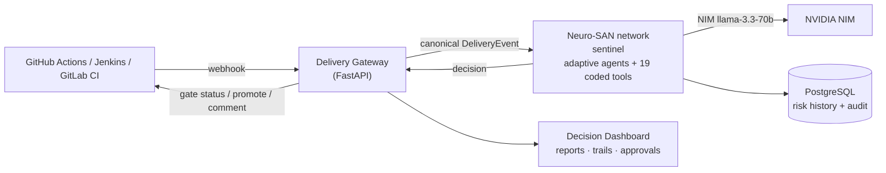

# 🚦 Sentinel — AI Delivery Intelligence Layer

**Multi-Agent Code Review · Smart Test Selection · Explainable Promotion Gating — built on [Neuro-SAN](https://github.com/cognizant-ai-lab/neuro-san).**

Cognizant Internal Hackathon project. One Neuro-SAN agent network acts as a connected intelligence layer across the delivery lifecycle (**review → test → promote**), where the output of each stage becomes a risk signal for the next: a Critical security finding raised in review mechanically raises the promotion risk score and can force human escalation — _even when every test passes_.

## The Problems

| #   | Problem                                                                                              |
| --- | ---------------------------------------------------------------------------------------------------- |
| P1  | Code review is a slow, inconsistent, multi-expert bottleneck (days, not hours)                       |
| P2  | CI runs the full test suite on every change — cost and latency scale with repo size, not change size |
| P3  | Promotion is binary pass/fail: no risk weighting, no context, no reasoning trail                     |
| P4  | The three gates are disconnected — signals never flow between them (the meta-problem)                |

## The Solution (at a glance)

- **Multi-agent first-pass review** — specialist Security and Code Quality agents return a severity-ranked, deduplicated review report in seconds.
- **Smart test selection** — deterministic diff + dependency-graph + test-mapping selects the relevant subset plus an always-on smoke set; the project's **own** test runner executes it (language-agnostic via manifest detection).
- **Explainable promotion gating** — review findings + test results + change profile + environment context converge into one deterministic risk score (`risk-v1`); a graduated **trust ladder** yields _Promote / Hold / Escalate_ with a full reasoning trail. Staging→production **never** auto-promotes.
- **Design spine:** _LLM reasons, code decides_ — scoring, policy and test execution are deterministic coded tools; LLM agents interpret, explain, and may only **raise** risk.

Primary LLM provider: **NVIDIA NIM** (`nvidia-llama-3.3-70b-instruct`) with provider-agnostic fallbacks; self-hosted NIM option keeps code in-company.

## Repository Layout

```text
.
├── README.md                          ← you are here
├── docs/
│   ├── hackathon-delivery-intelligence.md   # original problem statement & idea (source doc)
│   └── solution/                      # full design documentation set (start here)
│       ├── README.md                  # index & reading order
│       ├── 01-proposed-solution.md    # MASTER SPEC — single source of truth
│       ├── 02-dfd.md                  # data flow diagrams L0/L1/L2 + data dictionary
│       ├── 03-hld.md                  # high-level design (deployment, security, scale, ADRs)
│       ├── 04-lld.md                  # low-level design (HOCON, coded tools, DDL, APIs)
│       └── 05-architecture-diagram.md # six architecture views
└── neuro-san-studio/                  # clone of cognizant-ai-lab/neuro-san-studio
                                       # (framework reference: examples, docs, tooling)
```

## Documentation Set

| Read                                                            | For                                                                                                                                          |
| --------------------------------------------------------------- | -------------------------------------------------------------------------------------------------------------------------------------------- |
| [Solution index](docs/solution/README.md)                       | Reading order & doc map                                                                                                                      |
| [01 · Proposed Solution](docs/solution/01-proposed-solution.md) | What the system is and exactly how it works: 10-component agent network, risk formula, trust ladder, data contracts                          |
| [02 · DFD](docs/solution/02-dfd.md)                             | How data moves: context → system → subsystem drill-downs, flow invariants                                                                    |
| [03 · HLD](docs/solution/03-hld.md)                             | How it deploys and survives: K8s + docker-compose, security model, failure modes, design decisions                                           |
| [04 · LLD](docs/solution/04-lld.md)                             | How to build it: full network HOCON, 19 coded-tool specs, PostgreSQL DDL, Gateway API, CI/CD adapters (GitHub Actions / Jenkins / GitLab CI) |
| [05 · Architecture](docs/solution/05-architecture-diagram.md)   | The pictures: landscape, containers, agent topology, signal flow, deployments                                                                |

All diagrams are Mermaid — rendered natively by GitHub and VS Code (Markdown Preview Mermaid Support extension).

## System Shape (60-second version)



Ten pipeline components: `delivery_coordinator` (frontman) → `change_analysis` → `security_review` ∥ `code_quality` ∥ `environment_context` → `review_synthesis` → `test_selection` → `test_runner` (CodedTool) → `risk_scoring` → `promotion_gating`.

## Demo Scenarios (hackathon MVP)

1. **Happy path** — small clean change → clean review → small test subset passes → low risk → auto-promote (dev→test) with visible reasoning trail.
2. **The escalation (money shot)** — change touches auth module with planted string-concatenated SQL → Security agent flags **Critical** → risk spikes **although all tests pass** → gate escalates to human approval, reasoning trail citing the finding. Binary CI gating structurally cannot do this.

## Quickstart (host-native dev)

Prereqs: Python 3.12 + `.venv` (neuro-san 0.6.71), local PostgreSQL 17 (schema `sentinel`,
`DATABASE_URL` in `.env`), Node 20+, an `NVIDIA_API_KEY` in `.env`. Live tracker: [TASKS.md](TASKS.md).

**One command (Windows):** `.\run.ps1` — migrates the DB, builds the dashboard, starts both
servers, opens http://localhost:8000/. Flags: `-Demo` (run both demo runs after startup),
`-Fresh` (rebuild UI), `-OneWindow` (both servers in this terminal), `-Stop` (kill them).
The manual steps below are the equivalent, one process at a time.

```bash
# 1. DB schema
PYTHONPATH=. .venv/Scripts/python -m alembic -c db/alembic.ini upgrade head

# 2. Neuro-SAN network server (:8080) — wrapper loads .env (stock server does not)
PYTHONPATH=. .venv/Scripts/python scripts/run_server.py

# 3. Delivery Gateway (:8000) — REST + SSE + serves the built dashboard
PYTHONPATH=. GATEWAY_PORT=8000 .venv/Scripts/python scripts/run_gateway.py

# 4. Dashboard: build once, then the Gateway serves it at http://localhost:8000/
cd frontend && npm install && npm run build      # or `npm run dev` (:5173, proxies /api → :8000)
```

**Run the demo** (both acceptance runs end to end, prints a `/runs/compare` URL):

```bash
PYTHONPATH=. .venv/Scripts/python scripts/verify_c.py
```

**Watch the agent graph animate live** (fires both runs at the running Gateway and prints run
URLs to open while they stream — `verify_c.py` runs in-process so its live events don't reach
the server):

```bash
PYTHONPATH=. .venv/Scripts/python scripts/demo_live.py
# open the printed http://localhost:8000/runs/<id> immediately
```

Tests: `PYTHONPATH=. .venv/Scripts/python -m pytest -q` (48: 43 coded-tool + 5 gateway).

## Running on real repos

Full step-by-step (localhost + public-URL paths, real tests, troubleshooting): **[RUNNING_ON_REPOS.md](RUNNING_ON_REPOS.md)**. Quickest try against any public repo:

```powershell
$env:PYTHONPATH="."; .venv\Scripts\python.exe scripts\run_repo.py https://github.com/owner/repo
```

By default this reviews the repo's **last commit** (`HEAD~1..HEAD`). To review the **whole repo** (no CI integration, no diff), add `--full`:

```powershell
$env:PYTHONPATH="."; .venv\Scripts\python.exe scripts\run_repo.py --full https://github.com/owner/repo
```

`--full` is **audit mode**: it diffs against the git empty-tree so every file reads as added, then the security review adaptively fans out across 1–4 parallel reviewers sized to the repo (`review_planner`). The output is the review findings + honest coverage (how much was deep-reviewed vs deterministically scanned). **The promote/escalate decision is advisory in audit mode** — the risk formula is change-churn-driven, so a whole-repo "change" pegs risk high by construction; read the findings, not the verdict. The helper prints an `AUDIT MODE` banner to make this explicit.

### GitHub Action gate

Gate any repo's PRs on Sentinel's decision with [`.github/workflows/sentinel-gate.yml`](.github/workflows/sentinel-gate.yml) — copy it into the target repo's `.github/workflows/`. On each PR it builds a `github`-source DeliveryEvent and `POST`s it to `/api/v1/simulate`; the Gateway clones the repo server-side, runs the pipeline, and returns a decision. The check **fails unless the decision is `promote`** (escalate/hold block the merge until reviewed in the dashboard).

No new backend — it reuses the same `simulate` endpoint the demo uses. Two repo secrets:

- `SENTINEL_GATEWAY_URL` — a reachable Gateway base URL. For local dev, tunnel it: `cloudflared tunnel --url http://localhost:8000`.
- `SENTINEL_TOKEN` — an admin token from the Gateway's `API_TOKENS` (`simulate` is admin-only).

Tune `FROM_ENV`/`TO_ENV` in the workflow `env:` block for the promotion this gate represents (default `dev → test`). Limitations: same-repo PRs only (the Gateway clones `repo.url`, so a fork's head SHA isn't reachable — fork PRs are skipped).

## Status

- ✅ Problem definition ([docs/hackathon-delivery-intelligence.md](docs/hackathon-delivery-intelligence.md)) + full design ([docs/solution/](docs/solution/))
- ✅ **Implementation** (host-native): 19 coded tools (`coded_tools/sentinel/`), agent network (`registries/sentinel.hocon`) with adaptive security-review fan-out, Delivery Gateway (`gateway/`), Dashboard SPA (`frontend/`), DB (`db/`), shared lib + config. Milestones **M0–M4** met; both demo runs green through the Gateway (`scripts/verify_c.py`).
- ✅ **Audit mode + adaptive security fan-out**: `scripts/run_repo.py --full` runs the whole pipeline over any public repo; `review_planner` sizes 1–4 parallel `security_reviewer_*` by hotspot volume; `report_publisher` reports honest deep-review coverage (`scripts/verify_audit.py`).
- ✅ GitHub Action gate for real repos ([`.github/workflows/sentinel-gate.yml`](.github/workflows/sentinel-gate.yml)) — PRs post to `/api/v1/simulate`, check fails unless `promote`.
- ⬜ Phase 6 hardening + in-browser rehearsal (see [TASKS.md](TASKS.md)).

## Framework Reference

The [`neuro-san-studio/`](neuro-san-studio/) folder is a clone of the official studio repo used as the working reference for HOCON schemas, AAOSA protocol, coded-tool interfaces, server/deployment patterns and examples. Key entry points: [user guide](neuro-san-studio/docs/user_guide.md) · [examples](neuro-san-studio/docs/examples.md) · [tutorial](neuro-san-studio/docs/tutorial.md).
