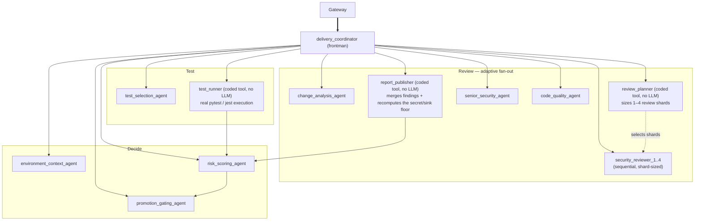
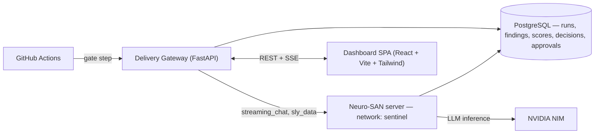

# Sentinel — Architecture

**Author:** Harshit Anand

## What we're building

Three delivery gates are broken today and disconnected from each other: code review is a slow, inconsistent human bottleneck; CI re-runs the full test suite on every change regardless of size; and promotion is a binary pass/fail with no risk weighting or reasoning trail. Because the gates don't talk to each other, a critical security finding in review has zero effect on whether a change gets promoted — as long as the (unrelated) tests are green, it ships.

**Sentinel** is an AI delivery intelligence layer that sits beside existing CI/CD (GitHub Actions — augments, never replaces) and connects the three gates into one pipeline: **review → test → promote**, where the output of each stage becomes a risk signal for the next. A critical security finding raised in review mechanically raises the promotion risk score and can force human escalation — even when every test passes.

## How it achieves that — the agentic system

The entire review/test/decision pipeline is **one Neuro-SAN multi-agent network** (registry `sentinel`, HOCON-defined, AAOSA-based orchestration) — this is not an ML model or a single LLM call, it's a supervised network of specialist agents, each backed by deterministic coded tools it can't bypass.

Nine to twelve agents fire per run depending on repo size (the security review fan-out is adaptive: `review_planner` sizes 1–4 reviewer shards from hotspot line count, not a fixed count). The frontman invokes one tool call at a time and waits for the result — the chain is dependency-ordered and must not race.

**Design spine — "LLM reasons, code decides":** every scoring, policy, and execution step is a deterministic coded tool, not an LLM judgment call:

- `risk_calculator` (formula `risk-v1`) — a versioned, monotonic point formula (security findings, test failures, blast radius, environment context); an LLM may only **raise** the score via a logged, justified escalation, never lower it.
- `trust_ladder` — policy-as-configuration mapping risk band → decision (`promote` / `hold` / `escalate`) per environment transition; **staging → production always requires human approval, hard-coded, policy cannot override it.**
- `test_runner` — executes the project's own real test runner (`pytest`, `jest`) on a deterministically-selected subset, never simulated.
- `report_publisher` — merges every review shard's findings in code and independently recomputes the secret/dangerous-sink floor, so a critical finding can't be lost to LLM ordering variance.

This split exists because LLM function-calling on a long dependency chain is not perfectly reliable (see below) — putting the parts that must never be wrong in code, not prompts, is what makes the system's decisions explainable and auditable rather than a black box.

### Risk model (`risk-v1`)

| Factor group | Rule | Points |
|---|---|---|
| Security findings | Critical / High / Medium / Low | +40 / +15 / +5 / +1 (capped) |
| Quality | `(100 − pr_health_score) × 0.15` | ≤15 |
| Test results | selected-test or smoke-set failure, low selection confidence | up to +45 |
| Change profile | sensitive-area flags, blast radius, change size | up to +30 |
| Environment context | recent incidents, deploy-window violations, unstable target | up to +15 |
| LLM anomaly escalation | raise-only, logged with justification | uncapped |

Bands: 0–24 low · 25–49 medium · 50–74 high · 75–100 critical. Every score carries a line-item explanation and a `formula_version`, so historical decisions stay interpretable as the formula evolves.

### Trust ladder

| Transition | low | medium | high | critical |
|---|---|---|---|---|
| dev → test | auto-promote | auto-promote | auto-promote | hold (≥90 escalate) |
| test → qa | auto-promote | hold | hold | escalate |
| qa → staging | auto-promote | escalate | escalate | escalate |
| staging → production | **always** human approval, hard floor | ← | ← | ← |

## System shape

- **Delivery Gateway** (`gateway/`, FastAPI, `:8000`) — accepts a `DeliveryEvent` (from a manual submit or a GitHub Action), clones the repo server-side, invokes the agent network, streams progress over SSE, and persists the allow-listed contracts (`review_reports`, `decisions`, and — since only those two are tool-persisted — `risk_score` / `test_results` / `test_plan` / `env_context` extracted from the returned `sly_data` on finalize). Also runs the approval queue, audit log, and run-compare API.
- **Neuro-SAN server** (`:8080`) — the sole multi-agent orchestrator, running the `sentinel` network end to end.
- **PostgreSQL** (schema `sentinel`) — runs, findings, risk history, decisions, approvals, review plans; the durable record behind every dashboard view.
- **Dashboard SPA** (`frontend/`, React 19 + Vite + Tailwind, plain fetch/EventSource) — Runs list, Run detail (live agent-network graph + stage timeline + review/test/risk/decision cards), Approvals (mandatory reject comment), Audit, Run compare.
- **LLM: NVIDIA NIM**, primary and provider-agnostic by construction (`langchain-nvidia-ai-endpoints`, fallback chain via config, no code change to swap providers or self-host).

## CI/CD integration

The same `POST /api/v1/simulate` endpoint serves manual runs, the demo scripts, and a drop-in `sentinel-gate.yml` GitHub Action: on every PR it builds a `DeliveryEvent` from the PR context, posts it to a reachable Gateway, polls the run, and fails the merge check unless the decision is `promote`. No separate webhook adapter — CI/CD posts to the same endpoint everything else uses.

## Audit mode

Beyond gating new changes, `--full` runs diff the whole repository against the git empty tree, so an entire existing codebase reads as "added" — a one-shot security/quality audit with the same adaptive multi-shard review and an honest `coverage` object (scanned lines, excluded files, deterministic coverage %) reported in the review.

## Non-goals (hackathon scope)

Java/Go/Rust static analysis (grammar + import-resolution cost per language, deferred), parallel (vs. sequential) security-review fan-out (deferred — merge is deterministic either way, so correctness is unaffected), and any post-hackathon learning-loop / test-generation / mutation-testing features (tracked separately, out of scope here by design).
