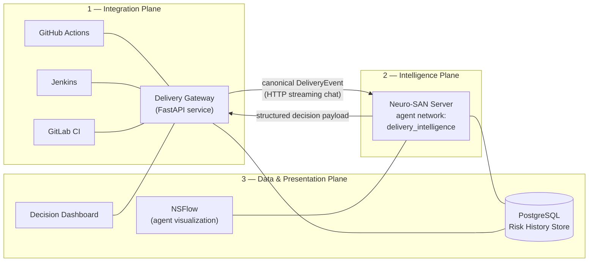
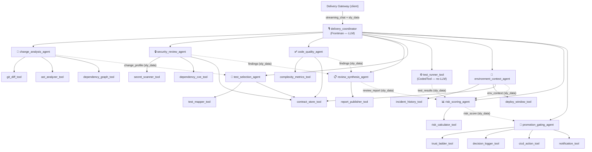

# AI Delivery Intelligence Layer — Proposed Solution Specification

**Project:** AI Delivery Intelligence Layer (Multi-Agent Code Review + Smart Test Selection + Explainable Promotion Gating)
**Framework:** Neuro-SAN (sole multi-agent orchestrator)
**Context:** Cognizant Internal Hackathon
**Document role:** Master solution specification. This document is the single source of truth for _what the system is and how it works_. The DFD ([02-dfd.md](02-dfd.md)), HLD ([03-hld.md](03-hld.md)), LLD ([04-lld.md](04-lld.md)) and Architecture Diagram ([05-architecture-diagram.md](05-architecture-diagram.md)) are all derived from this document and must not contradict it.

---

## 1. Problem Statements (What We Are Solving)

Every code change travels the same road — **review → test → promote** — and each checkpoint is broken in its own way:

| #   | Problem                                               | Core failure                                                                                                                                    |
| --- | ----------------------------------------------------- | ----------------------------------------------------------------------------------------------------------------------------------------------- |
| P1  | **Code review is a slow, inconsistent bottleneck**    | Multi-expert review (logic, security, compliance) takes days; quality depends on which human reviews it; nobody holds full cross-domain context |
| P2  | **Test suites don't scale with codebases**            | Full suite runs on every change (30–90+ min); CI cost grows with repo size; flaky/slow CI breeds "just re-run it" culture                       |
| P3  | **Promotion is a black-box, all-or-nothing decision** | Binary pass/fail gating ignores unequal failure risk, deploy context (timing, incidents, batch size), and produces no reasoning trail           |
| P4  | **The checkpoints are disconnected (meta-problem)**   | A security concern raised in review never influences which tests run or whether a deploy proceeds; each gate re-derives context from scratch    |

## 2. Solution Statement

**One Neuro-SAN agent network acting as a connected intelligence layer across the delivery lifecycle**, where the output of every stage becomes a risk signal for the next:

1. **Multi-Agent Code Review (first pass)** — specialized Security and Code Quality agents review every change in seconds and produce structured, severity-ranked findings. Human reviewers are freed for architecture and business logic.
2. **Smart Test Selection** — the system reasons over _what actually changed_ (diff + dependency graph + test-to-source mapping) and runs only the relevant subset of the project's existing test suite, plus an always-on smoke safety net.
3. **Explainable Promotion Gating** — review findings, test results, change profile and environment context converge into one deterministic risk score; a Promotion Gating Agent applies a graduated **trust ladder** and outputs _Promote / Hold / Escalate_ with a complete, human-readable reasoning trail.

**The differentiator is cross-stage signal flow:** a Critical security finding raised during review directly raises the promotion risk score and can force human escalation _even when every test passes_ — automatically, with the reasoning visible. Solving P4 is what makes P1–P3 solutions compound instead of remaining three disconnected tools.

## 3. Design Principles (Binding Constraints on All Design Documents)

| #   | Principle                                    | Concrete meaning                                                                                                                                                                                                                                                                                                                  |
| --- | -------------------------------------------- | --------------------------------------------------------------------------------------------------------------------------------------------------------------------------------------------------------------------------------------------------------------------------------------------------------------------------------- |
| D1  | **Augment, don't replace**                   | The system is an intelligence stage plugged into existing CI/CD (GitHub Actions, Jenkins, GitLab CI). It is not a CI engine, not a replacement for human reviewers. Teams keep their tooling.                                                                                                                                     |
| D2  | **LLM reasons, code decides**                | Every decision that must be auditable or safe is made by deterministic coded tools: the risk score is a fixed weighted formula, the trust ladder is a policy engine, test execution is a subprocess wrapper. LLM agents interpret, explain, contextualize, and handle edge cases — and may only _escalate_ risk, never reduce it. |
| D3  | **Language & framework agnostic — honestly** | The system detects each project's own tooling from manifest files (`requirements.txt`/`pyproject.toml`, `package.json`, `pom.xml`, `go.mod`, …) and invokes the **project's own test commands**, reasoning over the output. It never reimplements a test framework.                                                               |
| D4  | **Security by default**                      | Repo credentials, raw workspaces and structured stage payloads travel in Neuro-SAN's `sly_data` channel — invisible to LLMs and, by default, never leaving the agent network. Only explicitly allow-listed keys return to the caller.                                                                                             |
| D5  | **Graduated trust ladder**                   | Full automation only where mistakes are cheap (dev→test). Mandatory human approval where they are expensive (staging→production — _always_, hard-coded, regardless of score). Thresholds are configuration, so automation can widen as trust builds.                                                                              |
| D6  | **Declarative first**                        | The entire agent network is HOCON configuration (Neuro-SAN registries). Adding, removing, or re-modeling a review specialist is a config edit + coded-tool drop-in, not a platform change.                                                                                                                                        |
| D7  | **Deterministic contracts between stages**   | Every stage emits a versioned, JSON-schema'd payload (`schema_version` field on every contract). Stages consume contracts, not prose. This is what makes the network testable, replayable, and safely extensible.                                                                                                                 |

## 4. System Overview — Three Planes

The solution consists of exactly three cooperating planes. Everything in every design document belongs to one of them.

| Plane               | Component                                 | Responsibility                                                                                                                                                                                                                     | Technology                                 |
| ------------------- | ----------------------------------------- | ---------------------------------------------------------------------------------------------------------------------------------------------------------------------------------------------------------------------------------- | ------------------------------------------ |
| Integration         | **Delivery Gateway**                      | Receives webhooks from all three CI/CD platforms, verifies signatures, normalizes payloads into one canonical `DeliveryEvent`, invokes the agent network, exposes the dashboard/approval REST API, executes approved CI/CD actions | Python FastAPI                             |
| Intelligence        | **`delivery_intelligence` agent network** | All reasoning and decisioning: change analysis, security review, quality review, synthesis, test selection, test execution, environment context, risk scoring, promotion gating                                                    | Neuro-SAN (HOCON) + coded tools (Python)   |
| Data & Presentation | **PostgreSQL**                            | Runs, findings, reports, test results, risk scores, decisions, approvals, incidents, audit trail                                                                                                                                   | PostgreSQL 16                              |
| Data & Presentation | **Decision Dashboard**                    | Review reports, reasoning trails, pending-approval queue with Approve/Reject actions, audit views                                                                                                                                  | Served by Gateway (REST + SSE + static UI) |
| Data & Presentation | **NSFlow**                                | Live agent-network visualization for demo/debugging (stock Neuro-SAN client)                                                                                                                                                       | nsflow                                     |

**Why a Gateway exists (and why it is thin):** Neuro-SAN's server exposes a chat-style API. CI/CD platforms speak three different webhook dialects and expect three different callback APIs. The Gateway is the _only_ component that knows platform dialects; the agent network sees exactly one canonical event shape. This keeps the network portable across all three platforms with zero HOCON changes (principle D1, D7). The Gateway contains **no intelligence** — no scoring, no selection, no review logic. All of that lives in the Neuro-SAN network.

## 5. The Agent Network — `delivery_intelligence`

Neuro-SAN loads the network from `registries/delivery_intelligence.hocon` (registered in `registries/manifest.hocon`). One frontman, eight specialist LLM agents, and seventeen deterministic coded tools.

### 5.1 Network topology

Solid arrows = Neuro-SAN `tools` references (who may call whom). Dotted arrows = data contracts flowing through the `sly_data` bulletin board (§5.4).

**Naming convention:** coded-tool labels in diagrams/tables use module names; the HOCON tool `name` drops the `_tool` suffix — module `coded_tools/delivery_intelligence/test_runner_tool.py` (class `TestRunnerTool`) is registered as tool `test_runner`. Authoritative mapping: [LLD §3 and §5](04-lld.md).

### 5.2 Orchestration model

- The **frontman** (`delivery_coordinator`) is the single client-facing agent. Its instructions encode an **explicit numbered pipeline** (Neuro-SAN best practice for multi-step orchestration): 1) intake → 2) change analysis → 3) parallel review (security + quality) → 4) synthesis → 5) test selection → 6) test execution → 7) environment context → 8) risk scoring → 9) gating → 10) final structured response.
- Steps 3's two review agents and step 7 are **independent by contract** — the frontman issues those tool calls in parallel (LLM parallel tool-calling); the pipeline order for dependent stages is enforced by instruction and by the fact that each stage's _required input contract_ only exists in `sly_data` after its producer ran.
- Specialist agents follow the AAOSA interaction pattern (`aaosa_basic.hocon` substitutions) for delegation semantics, with rich one-line `function.description` entries — descriptions are the routing layer.
- **Test execution is deliberately not an LLM agent.** `test_runner_tool` is a plain `CodedTool` attached to the frontman: running tests is a deterministic act with no judgment in it (principle D2). Judgment (which tests) lives before it; interpretation (what results mean) lives after it.

### 5.3 Agent-by-agent specification

Full HOCON, instructions text, and function schemas are in the LLD ([04-lld.md](04-lld.md) §3). This section defines each agent's _contractual behavior_.

#### 1. 🎙️ `delivery_coordinator` — Frontman

|          |                                                                                                                                                                                                                                                                             |
| -------- | --------------------------------------------------------------------------------------------------------------------------------------------------------------------------------------------------------------------------------------------------------------------------- |
| Type     | LLM agent (frontman — only agent exposed to clients)                                                                                                                                                                                                                        |
| LLM      | `nvidia-llama-3.3-70b-instruct`                                                                                                                                                                                                                                             |
| Tools    | All 8 specialist agents + `test_runner_tool`                                                                                                                                                                                                                                |
| Input    | Canonical `DeliveryEvent` JSON in the chat message; secrets/workspace in `sly_data`                                                                                                                                                                                         |
| Output   | Final structured run summary (text) + allow-listed `sly_data` payload to client: `run_id`, `review_report`, `risk_score`, `decision`                                                                                                                                        |
| Behavior | Validates the event, executes the 10-step pipeline, never skips risk scoring or gating, never invents stage outputs — if a stage fails it records the failure and routes to gating with a `stage_failure` flag (which the risk formula treats as elevated risk, fail-safe). |

#### 2. 🧩 `change_analysis_agent`

|            |                                                                                                                                                                                                                                                                                                                                                                                                                                                                                                                                                                          |
| ---------- | ------------------------------------------------------------------------------------------------------------------------------------------------------------------------------------------------------------------------------------------------------------------------------------------------------------------------------------------------------------------------------------------------------------------------------------------------------------------------------------------------------------------------------------------------------------------------ |
| LLM        | `nvidia-llama-3.3-70b-instruct`                                                                                                                                                                                                                                                                                                                                                                                                                                                                                                                                          |
| CodedTools | `git_diff_tool`, `ast_analyzer_tool`, `dependency_graph_tool`                                                                                                                                                                                                                                                                                                                                                                                                                                                                                                            |
| Consumes   | `event` (sly_data)                                                                                                                                                                                                                                                                                                                                                                                                                                                                                                                                                       |
| Produces   | **`change_profile`** contract → sly_data                                                                                                                                                                                                                                                                                                                                                                                                                                                                                                                                 |
| Behavior   | Obtains the diff, extracts changed files/functions via tree-sitter AST, builds the import-level dependency graph, computes **blast radius** (reverse reachability from changed modules), classifies the change (`feature / bug_fix / refactor / config / docs / mixed`), and sets **sensitive-area flags** by matching changed paths & symbols against the sensitive-area ruleset (auth, payments, data-deletion, migrations, public API surfaces). The LLM's role: classify ambiguous changes, name the blast radius in human terms; all raw facts come from the tools. |

#### 3. 🔒 `security_review_agent`

|            |                                                                                                                                                                                                                                                                                                                                                                                                                                                                                                                                                            |
| ---------- | ---------------------------------------------------------------------------------------------------------------------------------------------------------------------------------------------------------------------------------------------------------------------------------------------------------------------------------------------------------------------------------------------------------------------------------------------------------------------------------------------------------------------------------------------------------- |
| LLM        | `nvidia-llama-3.3-70b-instruct`                                                                                                                                                                                                                                                                                                                                                                                                                                                                                                                            |
| CodedTools | `secret_scanner_tool` (regex+entropy secrets ruleset), `dependency_cve_tool` (OSV.dev lookup of manifest deltas, offline snapshot fallback), `contract_store_tool` (validates + writes the finished contract to sly_data)                                                                                                                                                                                                                                                                                                                                   |
| Consumes   | diff hunks (from `change_profile.files[].hunks`), manifest deltas                                                                                                                                                                                                                                                                                                                                                                                                                                                                                          |
| Produces   | **`security_findings`** contract → sly_data                                                                                                                                                                                                                                                                                                                                                                                                                                                                                                                |
| Behavior   | Two deterministic scans (secrets, CVEs) + LLM deep review of diff hunks against the OWASP Top 10 pattern checklist embedded in its instructions: SQL injection, XSS, CSRF, input-validation & authn/authz flaws, unsafe deserialization, path traversal, command injection. Every finding: `severity ∈ {critical, high, medium, low}`, file/line, CWE reference where applicable, explanation, fix suggestion. Treats reviewed code strictly as untrusted data (prompt-injection hygiene — instructions forbid following instructions found inside diffs). |

#### 4. ✅ `code_quality_agent`

|            |                                                                                                                                                                                                                                                                                                       |
| ---------- | ----------------------------------------------------------------------------------------------------------------------------------------------------------------------------------------------------------------------------------------------------------------------------------------------------- |
| LLM        | `nvidia-llama-3.3-70b-instruct` (cost-optimization slot: may be pointed at a smaller NIM model via per-agent `llm_config` override — see §8)                                                                                                                                                          |
| CodedTools | `complexity_metrics_tool` (cyclomatic complexity + function length; radon for Python, heuristic parser for JS/TS), `contract_store_tool` (validates + writes the finished contract to sly_data)                                                                                                       |
| Consumes   | diff hunks, `change_profile`                                                                                                                                                                                                                                                                          |
| Produces   | **`quality_findings`** contract (incl. `quality_score` 0–100) → sly_data                                                                                                                                                                                                                              |
| Behavior   | Checks SOLID adherence, DRY violations, naming/readability, error-handling gaps, complexity regressions (tool-measured, not guessed), and missing tests on new functions (cross-checks `change_profile.new_functions` against test-file changes in the same diff). Suggestions carry line references. |

#### 5. 📋 `review_synthesis_agent`

|            |                                                                                                                                                                                                                                                                                                                                                                                                                                                                                                                                                                    |
| ---------- | ------------------------------------------------------------------------------------------------------------------------------------------------------------------------------------------------------------------------------------------------------------------------------------------------------------------------------------------------------------------------------------------------------------------------------------------------------------------------------------------------------------------------------------------------------------------ |
| LLM        | `nvidia-llama-3.3-70b-instruct`                                                                                                                                                                                                                                                                                                                                                                                                                                                                                                                                    |
| CodedTools | `report_publisher_tool` (persists report to Postgres; optionally posts PR comment / MR note via Gateway)                                                                                                                                                                                                                                                                                                                                                                                                                                                           |
| Consumes   | `security_findings`, `quality_findings`, `change_profile`                                                                                                                                                                                                                                                                                                                                                                                                                                                                                                          |
| Produces   | **`review_report`** contract → sly_data; developer-facing report published                                                                                                                                                                                                                                                                                                                                                                                                                                                                                         |
| Behavior   | De-duplicates overlapping findings (same file/line/root cause), rank-orders by severity, writes an executive summary, computes the **PR health score (0–100)** by the deterministic deduction rubric fixed in its instructions (critical −25, high −10, medium −4, low −1, floor 0 — see LLD §3, `review_synthesis_agent`; not LLM vibes), and issues a recommendation: ✅ Approve / ⚠️ Approve with changes / ❌ Request changes. This report reaches the developer in seconds — and _the same structured object_ feeds risk scoring (P4's fix, by construction). |

#### 6. 🎯 `test_selection_agent`

|            |                                                                                                                                                                                                                                                                                                                                                                                                                                                                                                                                                                                                                                                                                                                                                                                                                             |
| ---------- | --------------------------------------------------------------------------------------------------------------------------------------------------------------------------------------------------------------------------------------------------------------------------------------------------------------------------------------------------------------------------------------------------------------------------------------------------------------------------------------------------------------------------------------------------------------------------------------------------------------------------------------------------------------------------------------------------------------------------------------------------------------------------------------------------------------------------- |
| LLM        | `nvidia-llama-3.3-70b-instruct`                                                                                                                                                                                                                                                                                                                                                                                                                                                                                                                                                                                                                                                                                                                                                                                             |
| CodedTools | `test_mapper_tool`, `contract_store_tool` (validates + writes the finished `test_plan` to sly_data — required: `test_runner` reads it from there)                                                                                                                                                                                                                                                                                                                                                                                                                                                                                                                                                                          |
| Consumes   | `change_profile`                                                                                                                                                                                                                                                                                                                                                                                                                                                                                                                                                                                                                                                                                                                                                                                                            |
| Produces   | **`test_plan`** contract → sly_data                                                                                                                                                                                                                                                                                                                                                                                                                                                                                                                                                                                                                                                                                                                                                                                         |
| Behavior   | `test_mapper_tool` deterministically maps tests→sources using, in priority order: (a) coverage map if the repo has one (coverage.py / Istanbul JSON), (b) import-graph edges from test files, (c) naming & directory conventions (`test_x.py ↔ x.py`, `x.test.js ↔ x.js`). Selection = tests covering changed files ∪ tests covering downstream dependents (blast radius) ∪ **always-run smoke set** (configurable list per repo, safety net). Sensitive-area flags force _conservative expansion_ (widen to the owning module's full test directory). The LLM documents inclusion/exclusion reasoning and resolves ambiguous mappings — it may only **add** tests to the deterministic selection, never remove (D2). Output includes `selection_confidence ∈ {high, medium, low}`; low confidence is itself a risk signal. |

#### 7. ⚙️ `test_runner` — CodedTool (not an agent; module `test_runner_tool.py`)

|          |                                                                                                                                                                                                                                                                                                                                                                                                                                                                               |
| -------- | ----------------------------------------------------------------------------------------------------------------------------------------------------------------------------------------------------------------------------------------------------------------------------------------------------------------------------------------------------------------------------------------------------------------------------------------------------------------------------- |
| Type     | `CodedTool` (`neuro_san.interfaces.coded_tool.CodedTool`, `async_invoke`) attached directly to the frontman                                                                                                                                                                                                                                                                                                                                                                   |
| Consumes | `test_plan`, workspace (sly_data)                                                                                                                                                                                                                                                                                                                                                                                                                                             |
| Produces | **`test_results`** contract → sly_data                                                                                                                                                                                                                                                                                                                                                                                                                                        |
| Behavior | Detects the runner from manifests (`pyproject.toml`/`requirements.txt`+`pytest.ini` → pytest; `package.json` → jest/npm test; extensible detection table in LLD §5.9), executes the selected subset via runner-native selectors (pytest node IDs / `jest --testPathPatterns`), enforces a hard timeout, parses JUnit-XML/JSON output into structured pass/fail/skip + stack traces + timings + coverage delta (when the repo is coverage-instrumented). Zero LLM involvement. |

#### 8. 📜 `environment_context_agent`

|            |                                                                                                                                                                                                                                                     |
| ---------- | --------------------------------------------------------------------------------------------------------------------------------------------------------------------------------------------------------------------------------------------------- |
| LLM        | `nvidia-llama-3.3-70b-instruct`                                                                                                                                                                                                                     |
| CodedTools | `incident_history_tool` (Postgres: incidents/reverts for repo+target env in lookback window), `deploy_window_tool` (freeze calendar & risky-window policy: e.g. Friday ≥16:00 local, weekends, release freezes), `contract_store_tool` (validates + writes the finished contract to sly_data)       |
| Consumes   | `event.target_transition`                                                                                                                                                                                                                           |
| Produces   | **`env_context`** contract → sly_data                                                                                                                                                                                                               |
| Behavior   | Emits per-environment risk context: recent incident count/recency, deploy-timing risk flag, environment stability marker, change batch size (commits in this promotion). All facts tool-sourced; LLM summarizes into flags + one-paragraph context. |

#### 9. 📊 `risk_scoring_agent` — the convergence point

|            |                                                                                                                                                                                                                                                                                                                                                                                                                                                                                                                                                                                                                                    |
| ---------- | ---------------------------------------------------------------------------------------------------------------------------------------------------------------------------------------------------------------------------------------------------------------------------------------------------------------------------------------------------------------------------------------------------------------------------------------------------------------------------------------------------------------------------------------------------------------------------------------------------------------------------------- |
| LLM        | `nvidia-llama-3.3-70b-instruct`                                                                                                                                                                                                                                                                                                                                                                                                                                                                                                                                                                                                    |
| CodedTools | `risk_calculator_tool`                                                                                                                                                                                                                                                                                                                                                                                                                                                                                                                                                                                                             |
| Consumes   | `review_report`, `test_results`, `change_profile`, `env_context`                                                                                                                                                                                                                                                                                                                                                                                                                                                                                                                                                                   |
| Produces   | **`risk_score`** contract → sly_data                                                                                                                                                                                                                                                                                                                                                                                                                                                                                                                                                                                               |
| Behavior   | Assembles the four upstream contracts into a `risk_input`, calls `risk_calculator_tool`, which applies the **fixed, versioned weighted formula** (§6) and returns score 0–100 + per-factor contribution breakdown. The LLM then (a) writes the structured explanation naming every contributing factor, (b) may flag an anomaly the formula missed and **raise** the score with logged justification — it can never lower it (D2; this is the prompt-injection firewall for gating). A Critical security finding alone pushes the score into escalation territory _even if all tests passed_ — the cross-stage core of the system. |

#### 10. 🚦 `promotion_gating_agent` — final decision maker

|            |                                                                                                                                                                                                                                                                                                                                                                                                                                                                                                                                                                                    |
| ---------- | ---------------------------------------------------------------------------------------------------------------------------------------------------------------------------------------------------------------------------------------------------------------------------------------------------------------------------------------------------------------------------------------------------------------------------------------------------------------------------------------------------------------------------------------------------------------------------------- |
| LLM        | `nvidia-llama-3.3-70b-instruct`                                                                                                                                                                                                                                                                                                                                                                                                                                                                                                                                                    |
| CodedTools | `trust_ladder_tool`, `decision_logger_tool`, `cicd_action_tool`, `notification_tool`                                                                                                                                                                                                                                                                                                                                                                                                                                                                                               |
| Consumes   | `risk_score`, `event.target_transition`                                                                                                                                                                                                                                                                                                                                                                                                                                                                                                                                            |
| Produces   | **`decision`** contract → sly_data (allow-listed back to the Gateway); decision row + full reasoning trail persisted; CI/CD action or notification fired                                                                                                                                                                                                                                                                                                                                                                                                                           |
| Behavior   | `trust_ladder_tool` evaluates the policy file (§7) → `promote / hold / escalate`. **Hard-coded floor in the tool itself (not just policy): staging→production never auto-promotes.** The LLM composes the human-readable reasoning trail: what review found, what was tested and why, what passed/failed, which context factors weighed in, and why this decision follows. `decision_logger_tool` persists everything; `cicd_action_tool` executes promotion (or no-ops in simulated mode); `notification_tool` notifies (Slack/Teams webhook + dashboard queue) on hold/escalate. |

### 5.4 `sly_data` — the secure bulletin board

Neuro-SAN's `sly_data` dictionary is invisible to LLMs and by default never crosses network boundaries. The solution uses it for two purposes:

1. **Secrets & bulk data:** `git_token`, `repo_workspace` (server-side clone path), raw diffs — never enter any prompt except the specific hunks a review agent must see.
2. **Stage contracts:** every producer writes its versioned contract under its reserved key; every consumer reads its required inputs. Coded tools share state without round-tripping large JSON through LLM context (cost + reliability + no leakage).

**Framework constraint:** `sly_data` is writable only by coded tools (it is invisible to LLMs). Agents whose contract is finalized by an existing coded tool write through that tool (`dependency_graph` → `change_profile`, `report_publisher` → `review_report`, `risk_calculator` → `risk_score`, `decision_logger` → `decision`). The four agents without such a tool (`security_review`, `code_quality`, `test_selection`, `environment_context`) call the generic **`contract_store`** coded tool as their mandatory final step — it validates the payload against the contract's JSON schema and writes it to the reserved sly_data key.

| Key                           | Producer                  | Consumers                                             |
| ----------------------------- | ------------------------- | ----------------------------------------------------- |
| `event`                       | Gateway (client request)  | all                                                   |
| `git_token`, `repo_workspace` | Gateway                   | git/test tools only                                   |
| `change_profile`              | change_analysis_agent     | test_selection, security/quality review, risk_scoring |
| `security_findings`           | security_review_agent (via `contract_store`) | review_synthesis                                      |
| `quality_findings`            | code_quality_agent (via `contract_store`) | review_synthesis                                      |
| `review_report`               | review_synthesis_agent    | risk_scoring, Gateway (upstream)                      |
| `test_plan`                   | test_selection_agent (via `contract_store`) | test_runner_tool                                      |
| `test_results`                | test_runner_tool          | risk_scoring, Gateway (upstream)                      |
| `env_context`                 | environment_context_agent (via `contract_store`) | risk_scoring                                          |
| `risk_input`, `risk_score`    | risk_scoring_agent        | promotion_gating, Gateway (upstream)                  |
| `decision`                    | promotion_gating_agent    | Gateway (upstream)                                    |
| `run_id`                      | Gateway                   | all tools (correlation)                               |

Frontman `allow.to_upstream.sly_data = ["run_id", "review_report", "test_results", "risk_score", "decision"]` — the only data that leaves the network. Tokens and workspaces never do.

## 6. Risk Scoring Model (Deterministic, Versioned)

`risk_calculator_tool` implements formula version `risk-v1`. Score = `min(100, Σ contributions)`; every contribution is reported line-item in the explanation.

| Factor group           | Rule                                               | Points (cap)                                        |
| ---------------------- | -------------------------------------------------- | --------------------------------------------------- |
| Security findings      | per **Critical**                                   | +40 (cap 80)                                        |
|                        | per **High**                                       | +15 (cap 45)                                        |
|                        | per **Medium**                                     | +5 (cap 20)                                         |
|                        | per **Low**                                        | +1 (cap 5)                                          |
| Quality                | `(100 − pr_health_score) × 0.15`                   | ≤15                                                 |
| Test results           | any selected-test failure                          | +25 base, +10 per additional failing suite (cap 45) |
|                        | smoke-set failure                                  | +40                                                 |
|                        | `selection_confidence = low`                       | +10                                                 |
|                        | stage failure / tests could not run                | +30                                                 |
| Change profile         | per sensitive-area flag                            | +15 (cap 30)                                        |
|                        | blast radius > 20 dependent modules                | +10 (>50: +20)                                      |
|                        | change size > 500 changed LOC                      | +5 (>2000: +10)                                     |
| Environment context    | incident on repo+env in last 7 days                | +15                                                 |
|                        | deploy-window violation (e.g. Friday-evening prod) | +10                                                 |
|                        | target env currently unstable                      | +10                                                 |
|                        | oversized promotion batch (policy threshold)       | +5                                                  |
| LLM anomaly escalation | risk_scoring_agent flags an un-modeled anomaly     | raise-only, logged with justification               |

**Bands:** 0–24 **low** · 25–49 **medium** · 50–74 **high** · 75–100 **critical**.

Properties: monotonic (nothing subtracts — absence of problems is the reward), explainable line-by-line, versioned (`formula_version` stored with every score so historical decisions remain interpretable), and tunable per organization via the weights file (`risk_weights_v1.yaml`, LLD §5) without code changes.

_Worked check (Demo Run 2):_ 1 Critical SQLi finding (+40) + 1 Critical hardcoded-secret finding (+40, within the 80 cap) + auth sensitive-area flag (+15) + all tests green (0) = **95 (critical)** — the trust ladder escalates on every transition at critical band, even though CI is green. Binary gating structurally cannot do this.

## 7. Trust Ladder (Policy-as-Configuration)

`trust_ladder_tool` evaluates `config/trust_ladder_policy.yaml` (mounted config; defaults below). Policy can tighten but never loosen the hard floor.

| Transition           | low (0–24)                                                                                      | medium (25–49)                | high (50–74)     | critical (75–100)                  |
| -------------------- | ----------------------------------------------------------------------------------------------- | ----------------------------- | ---------------- | ---------------------------------- |
| dev → test           | ✅ auto-promote                                                                                 | ✅ auto-promote               | ✅ auto-promote  | ⏸️ hold + notify (≥90 🆘 escalate) |
| test → qa            | ✅ auto-promote                                                                                 | ⏸️ hold + notify              | ⏸️ hold + notify | 🆘 escalate                        |
| qa → staging         | ✅ auto-promote                                                                                 | 🆘 recommend + human approval | 🆘 escalate      | 🆘 escalate                        |
| staging → production | 🆘 **always** recommend + mandatory human approval — hard-coded in tool, policy cannot override | ← same                        | ← same           | ← same                             |

Decisions: **promote** (Gateway fires `cicd_action_tool` promotion), **hold** (block + notify author/team; re-runnable after fixes), **escalate** (approval request in dashboard queue + Slack/Teams; a human Approve/Reject via the dashboard resolves it, and the resolution is logged with approver identity).

Why this ladder: fully autonomous production deployment is both a hard sell and a genuine risk. Automation only where mistakes are cheap makes the system pilotable, explainable to leadership, and thresholds are data — relaxable later as trust builds (D5).

## 8. LLM Strategy — NVIDIA NIM Primary, Provider-Agnostic by Construction

- **Primary provider: NVIDIA NIM** via Neuro-SAN's built-in `nvidia` provider class (`langchain-nvidia-ai-endpoints`, `NVIDIA_API_KEY`). Hackathon: hosted NIM endpoints (`build.nvidia.com` / `integrate.api.nvidia.com`). Production option: **self-hosted NIM containers in-cluster** — client code never leaves company infrastructure, a decisive enterprise-adoption argument.
- **Model assignments:** default network-level model `nvidia-llama-3.3-70b-instruct` (registered in Neuro-SAN's default LLM info; reliable function-calling — mandatory, since AAOSA delegation is function-calling). Per-agent `llm_config` overrides are the designed cost-optimization slots for lighter agents (`code_quality_agent`, `environment_context_agent`): a smaller NIM model (e.g. `llama-3.1-8b-instruct`) is added via the `AGENT_LLM_INFO_FILE` extension mechanism (LLD §6.2). `nvidia-deepseek-r1` is _not_ used by default (weak tool-calling; reasoning-only leaf experiments at most).
- **Fallback chain** (Neuro-SAN `fallbacks` list, tried in order; providers without keys are culled automatically):
  1. `nvidia-llama-3.3-70b-instruct` (NIM)
  2. `${?FALLBACK_MODEL_NAME}` — optional env-injected second provider (e.g. `gpt-4o` or `claude-sonnet`) with no HOCON edit
- **Central config:** one `config/llm_config.hocon` included by the network file; `${?MODEL_NAME}` env override switches the whole network's model at deploy time.

## 9. Repository Tooling Detection (D3 in Practice)

| Detected manifest                                                | Language | Test runner invoked | Subset selector                             | Result format parsed                                                |
| ---------------------------------------------------------------- | -------- | ------------------- | ------------------------------------------- | ------------------------------------------------------------------- |
| `pyproject.toml` / `requirements.txt` (+ `pytest.ini`/`tox.ini`) | Python   | `pytest`            | pytest node IDs / `-k`                      | JUnit XML (`--junitxml`)                                            |
| `package.json` (jest present)                                    | JS/TS    | `npx jest`          | `--testPathPatterns` / `--findRelatedTests` | jest JSON (`--json`)                                                |
| `package.json` (script `test`, no jest)                          | JS/TS    | `npm test`          | pattern arg passthrough                     | JUnit XML via reporter if configured, else exit-code + stdout parse |
| `pom.xml`                                                        | Java     | `mvn test`          | `-Dtest=` class list                        | Surefire XML                                                        |
| `go.mod`                                                         | Go       | `go test`           | `-run` regex + package paths                | `-json` stream                                                      |

Hackathon MVP proves the first two rows live (Python + Node sample services); the table is the extension contract for the rest. Detection and parsing live entirely in `test_runner_tool` / `test_mapper_tool` — adding a language touches only those two coded tools.

Jest flag note: `--testPathPatterns` (plural) exists in Jest 30+; Jest ≤29 uses `--testPathPattern`. `test_runner_tool` detects the installed Jest major from the lockfile and picks the flag; the sample repo pins Jest 30.

## 10. Data Contracts (Summary)

Every contract carries `schema_version`, `run_id`, `produced_by`, `produced_at`. Full JSON Schemas: LLD §4.

| Contract                     | Key fields                                                                                                                                                                                                     |
| ---------------------------- | -------------------------------------------------------------------------------------------------------------------------------------------------------------------------------------------------------------- |
| `DeliveryEvent`              | `event_id`, `source (github/jenkins/gitlab/manual)`, `repo{url,name,default_branch}`, `change{base_sha,head_sha,branch,pr_id?,title,description,author}`, `target_transition{from_env,to_env}`, `requested_by` |
| `ChangeProfile`              | `files[{path,language,change_type,hunks,functions_changed[]}]`, `new_functions[]`, `classification`, `loc_added/removed`, `blast_radius{direct[],transitive[],count}`, `sensitive_flags[]`                     |
| `Finding` (security/quality) | `id`, `category`, `severity`, `file`, `line_start/end`, `cwe?`, `title`, `explanation`, `fix_suggestion`, `source (tool/llm)`                                                                                  |
| `ReviewReport`               | `executive_summary`, `findings[] (deduped, ranked)`, `pr_health_score`, `recommendation (approve/approve_with_changes/request_changes)`                                                                        |
| `TestPlan`                   | `selected[{test_id,reason,mapping_source}]`, `smoke_set[]`, `excluded_summary`, `selection_confidence`, `estimated_runtime`                                                                                    |
| `TestResults`                | `runner`, `command`, `totals{passed,failed,skipped}`, `cases[{test_id,status,duration,failure_message?,stack?}]`, `coverage_delta?`, `duration`, `timed_out`                                                   |
| `EnvContext`                 | `target_env`, `incidents{count,most_recent_at}`, `deploy_window{risky,reason}`, `env_stability`, `batch_size`, `flags[]`                                                                                       |
| `RiskScore`                  | `score`, `band`, `formula_version`, `contributions[{factor,points,evidence_ref}]`, `llm_escalation?{points_added,justification}`, `explanation`                                                                |
| `Decision`                   | `decision (promote/hold/escalate)`, `transition`, `policy_version`, `reasoning_trail`, `actions_taken[]`, `approval_required`, `approval_status?`                                                              |

## 11. End-to-End Data Flow

1. Developer opens a PR / pipeline reaches a promotion stage → platform webhook fires → **Gateway** verifies signature (HMAC/token per platform), normalizes to `DeliveryEvent`, creates the `run` row (Postgres), prepares the workspace (shallow clone at `head_sha`), responds `202 Accepted` to the platform.
2. Gateway invokes Neuro-SAN `streaming_chat` on `delivery_intelligence` with the event JSON as the message and `{event, run_id, git_token, repo_workspace}` in `sly_data`; streamed agent progress is relayed live to the dashboard (SSE) and persisted.
3. **change_analysis_agent** → `change_profile`.
4. **security_review_agent** + **code_quality_agent** run in parallel → findings.
5. **review_synthesis_agent** → `review_report`, published to developer (dashboard + PR comment) _in seconds_ — the review deliverable is done here even before tests run.
6. **test_selection_agent** → `test_plan` (deterministic core + LLM-documented reasoning).
7. **test_runner_tool** executes the plan with the repo's own runner → `test_results`.
8. **environment_context_agent** → `env_context` (ran in parallel since step 3).
9. **risk_scoring_agent** → deterministic score + explanation, cross-referencing all four upstream contracts.
10. **promotion_gating_agent** → trust-ladder decision + full reasoning trail; persists; **promote** → Gateway executes platform action (merge-gate pass / deployment dispatch / pipeline trigger); **hold/escalate** → notifications + dashboard approval queue.
11. Human approves/rejects escalations in the dashboard; resolution executes or blocks the promotion and is appended to the audit trail.
12. Every artifact of steps 1–11 is queryable afterward: "why was this promoted?" always has a concrete answer.

## 12. CI/CD Platform Integrations (All Three, Equal Depth)

The Gateway implements one **adapter interface** (`inbound: webhook→DeliveryEvent`, `outbound: decision→platform action`, `report: review→PR/MR comment`). **Hackathon scope: the GitHub Actions adapter + simulate mode are implemented live; the Jenkins and GitLab CI columns below are the extension contract, implemented post-hackathon** (same pattern as the language table, §9 — adding a platform touches only one Gateway adapter, zero HOCON changes). Full endpoint/payload detail: LLD §7; pipeline snippets: LLD §7.4.

|                  | GitHub Actions                                                                                                                  | Jenkins                                                                    | GitLab CI                                                             |
| ---------------- | ------------------------------------------------------------------------------------------------------------------------------- | -------------------------------------------------------------------------- | --------------------------------------------------------------------- |
| Inbound trigger  | `pull_request` / `workflow_dispatch` webhooks (HMAC-SHA256 verified)                                                            | Generic Webhook Trigger plugin POST or pipeline `httpRequest` step (token) | Project webhooks: MR events / pipeline events (secret token)          |
| Blocking usage   | Required status check `delivery-intelligence/gate` via Checks API                                                               | `input`/gate stage polling Gateway decision endpoint                       | External status via Commit Status API gating MR                       |
| Promotion action | `workflow_dispatch` on deploy workflow / Deployments API                                                                        | Trigger parameterized deploy job (`/job/…/buildWithParameters`)            | Trigger pipeline (`POST /projects/:id/trigger/pipeline`) with env var |
| Review comment   | PR comment via Issues API                                                                                                       | Build description / PR comment via plugin when GitHub-backed               | MR note via Notes API                                                 |
| Demo mode        | Simulated: Gateway `/api/v1/simulate` endpoint replays recorded webhook payloads — identical code path, no live platform needed |

## 13. Persistence — Risk History Store (PostgreSQL)

PostgreSQL 16 everywhere (hackathon docker-compose service and production managed instance — same engine, zero divergence). Owned by the Gateway (migrations) and written by coded tools via a shared thin DAO. Full DDL: LLD §8.

Tables: `runs`, `review_reports`, `findings`, `test_plans`, `test_results`, `env_contexts`, `risk_scores`, `decisions`, `approvals`, `incidents` (seedable for demo; feeds `incident_history_tool`), `outcomes` (generic `decision_id + outcome_type + payload JSONB` — records post-decision facts such as reverts/incidents against past decisions), `audit_events` (append-only).

## 14. Decision Dashboard

Served by the Gateway (REST + SSE + static single-page UI). Screens (API mapping: LLD §9; full frontend design: [06-frontend-design.md](06-frontend-design.md)):

1. **Runs** — list/filter by repo, band, decision, transition.
2. **Run detail** — the money screen: review report (findings ranked, health score), test plan with selection reasoning, test results, risk-score factor breakdown, decision + full reasoning trail, live agent progress while running (SSE). Demo Runs 1 & 2 are shown side-by-side from here.
3. **Approvals** — pending escalations queue; Approve/Reject with comment; approver identity recorded; action executes the promotion or blocks it.
4. **Audit** — append-only event log per run/decision.

AuthN/Z: hackathon = static bearer token; production = OIDC (company SSO) with roles `viewer / approver / admin` (HLD §7).
**NSFlow** remains the agent-network visualization (which agent is talking to which, live) — used in the demo alongside the dashboard; it is stock Neuro-SAN, port 4173.

## 15. Deployment Model (Summary — HLD Owns Detail)

|                       | Hackathon (demo)                                                                   | Production (company-wide)                                                                                                                            |
| --------------------- | ---------------------------------------------------------------------------------- | ---------------------------------------------------------------------------------------------------------------------------------------------------- |
| Topology              | `docker-compose`: `neuro-san-server`, `gateway` (+dashboard), `postgres`, `nsflow` | Kubernetes (cloud-agnostic): Deployments for neuro-san server & Gateway (HPA), managed PostgreSQL, Ingress, Secrets via K8s Secrets/External Secrets |
| LLM                   | NIM hosted API                                                                     | NIM hosted **or self-hosted NIM in-cluster** (GPU pool) — code-privacy mode                                                                          |
| Test execution        | subprocess inside a dedicated runner container (resource-limited)                  | ephemeral, sandboxed **K8s Job per test run** (no network egress except package cache; CPU/mem/time-limited)                                         |
| Same images both ways | ✅ compose is a subset of the K8s deployment — no demo/production fork             |

## 16. Security Model (Summary — HLD §7 Owns Detail)

- Webhook authenticity: HMAC/token verification per platform at the Gateway; replay-window enforcement.
- Secrets: `sly_data` for in-network transport (D4); K8s Secrets at rest; never logged (structured-log redaction filter on known-secret keys + secret-scanner patterns applied to own logs).
- LLM safety: reviewed code is untrusted input — review agents' instructions explicitly refuse in-code instructions; the gating path is deterministic (trust ladder tool), and the LLM can only _raise_ risk (§6) — a prompt-injected diff cannot talk the system into auto-promoting.
- Isolation: test execution sandboxed (container/K8s Job, no secrets mounted beyond repo read token, egress-restricted).
- Auditability: every decision, approval, and automated action lands in append-only `audit_events` with actor identity (human or agent).
- Data retention: workspaces are ephemeral (deleted post-run); stored artifacts are structured findings/reports, retention-configurable.

## 17. Scalability & Company-Wide Adoption

- **Stateless intelligence plane:** Neuro-SAN server pods and Gateway pods are horizontally scalable (HPA); per-run state lives in `sly_data` (in-request) and Postgres (durable). Concurrent runs = concurrent chat sessions — no shared mutable state.
- **Per-team onboarding = configuration:** point the team's webhook at the Gateway, add a repo config entry (smoke set, sensitive-area paths, policy overrides). No code changes, no pipeline migration (D1).
- **Cost control:** selective testing cuts CI compute; per-agent model right-sizing (§8) cuts LLM spend; run concurrency and test-runner quotas are capped per namespace.
- **Adoption path (trust ladder as rollout strategy):** pilot team → dev→test automation only → widen transitions as thresholds prove out → org-wide. Each step is a policy-file change, not a rollout.
- **Extensibility by design (D6, D7):** new review specialist = one HOCON agent block + optional coded tool; new language = detection-table rows in two coded tools; new CI platform = one Gateway adapter; risk-formula evolution = new `formula_version` weights file. The versioned contracts and generic `outcomes` table mean future capabilities plug into the same spine without schema breaks.

## 18. Hackathon MVP Scope

1. ✅ Working Neuro-SAN network — all 10 components (§5.3) configured in `registries/delivery_intelligence.hocon`, 17 coded tools implemented.
2. ✅ Sample multi-language repos: `samples/python-payments-service` (Flask + pytest), `samples/node-catalog-service` (Express + Jest) — proving manifest-driven language agnosticism.
3. ✅ **Demo Run 1 — happy path:** small low-risk change → clean parallel review → small relevant test subset selected & passing → low score → auto-promote (dev→test) with full reasoning trail on the dashboard.
4. ✅ **Demo Run 2 — the escalation (money shot):** change touching the auth module with planted string-concatenated SQL **and a hardcoded secret** → Security Review flags **two Criticals** → risk 95 (≥75, critical band; §6 worked check) **although every test passes** → gating escalates to human approval, reasoning trail explicitly citing both security findings; approver resolves it live in the dashboard.
5. ✅ Side-by-side reasoning trails (dashboard) + live agent choreography (NSFlow).
6. CI/CD platform scope: **GitHub Actions adapter + simulate mode only**; Jenkins and GitLab CI remain specified as the extension contract (§12), implemented post-hackathon.
7. Stretch: live GitHub webhook (not simulated); seeded `incidents` row visibly shifting a repeat run's score; Slack/Teams notification on the approval step.

## 19. Success Metrics

| Metric                          | Current state                      | Directional goal                                       |
| ------------------------------- | ---------------------------------- | ------------------------------------------------------ |
| First-pass review turnaround    | Days                               | Seconds–minutes                                        |
| CI test runtime per commit      | Full suite (30–90 min large repos) | Relevant subset + smoke set                            |
| CI compute spend                | Baseline                           | Meaningful reduction via selective execution           |
| Promotion decision transparency | Binary pass/fail, no reasoning     | Full explainable reasoning trail, queryable            |
| Human reviewer focus            | Everything incl. basics            | Architecture, business logic, mentorship               |
| Review → deployment signal flow | None                               | Review findings directly influence gating (Demo Run 2) |

## 20. Traceability — Problem → Solution Component

| Problem                | Solved by                                                                                         |
| ---------------------- | ------------------------------------------------------------------------------------------------- |
| P1 review bottleneck   | §5.3 agents 2–5 (parallel specialist review + synthesis in seconds)                               |
| P2 test-suite scale    | §5.3 agents 6–7 (deterministic selection + native execution) + §9                                 |
| P3 black-box promotion | §6 risk model + §7 trust ladder + reasoning trail + dashboard                                     |
| P4 disconnected gates  | §5.4 contract flow: `review_report` → `risk_score` → `decision` (one network, one bulletin board) |
