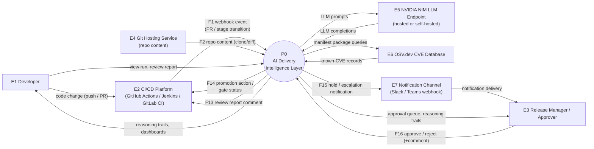
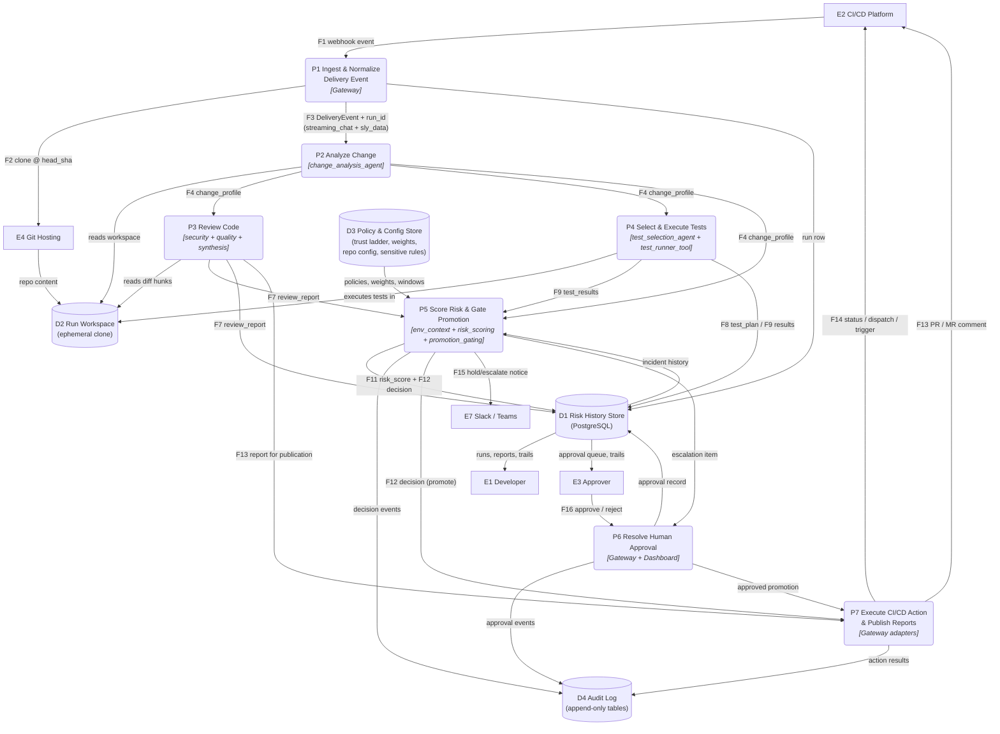
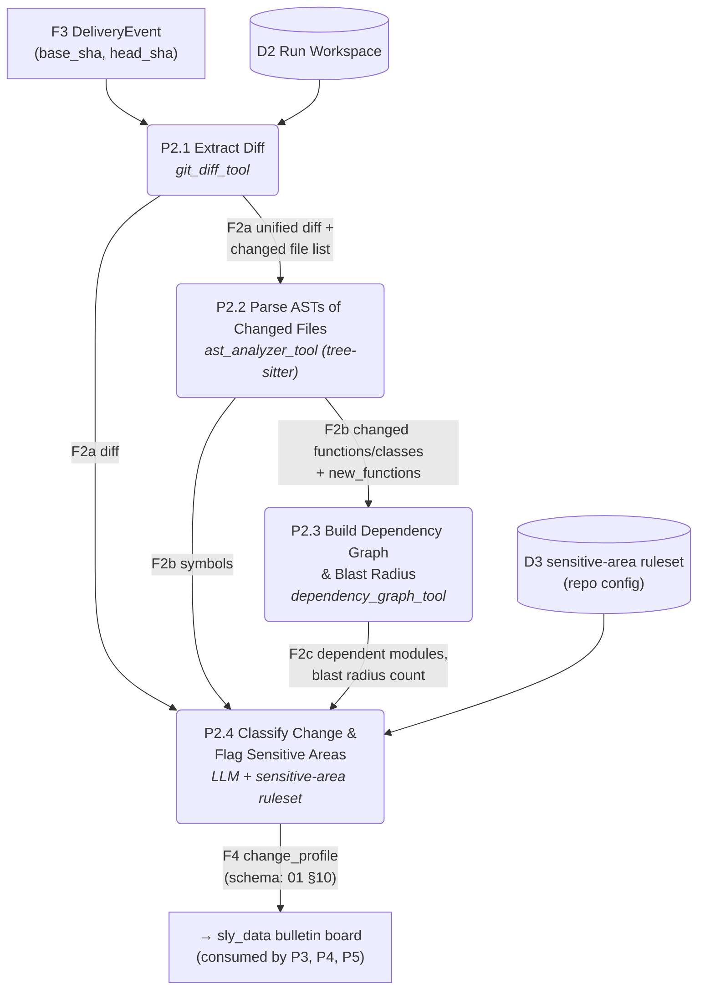
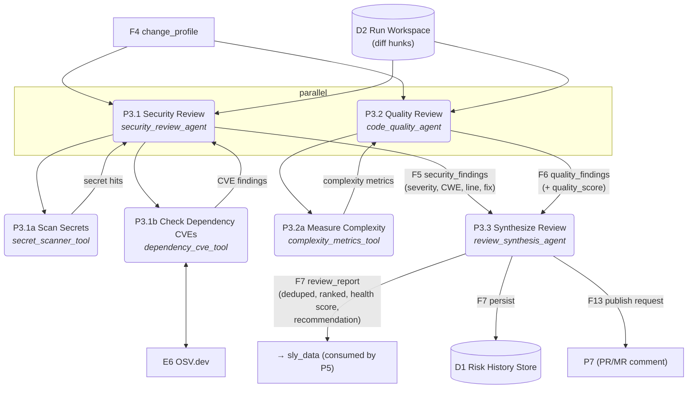
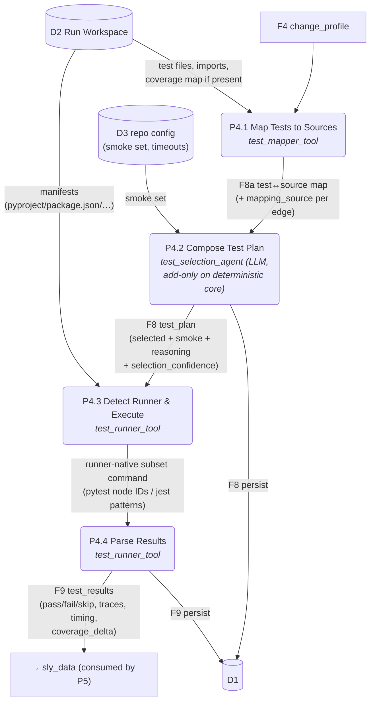
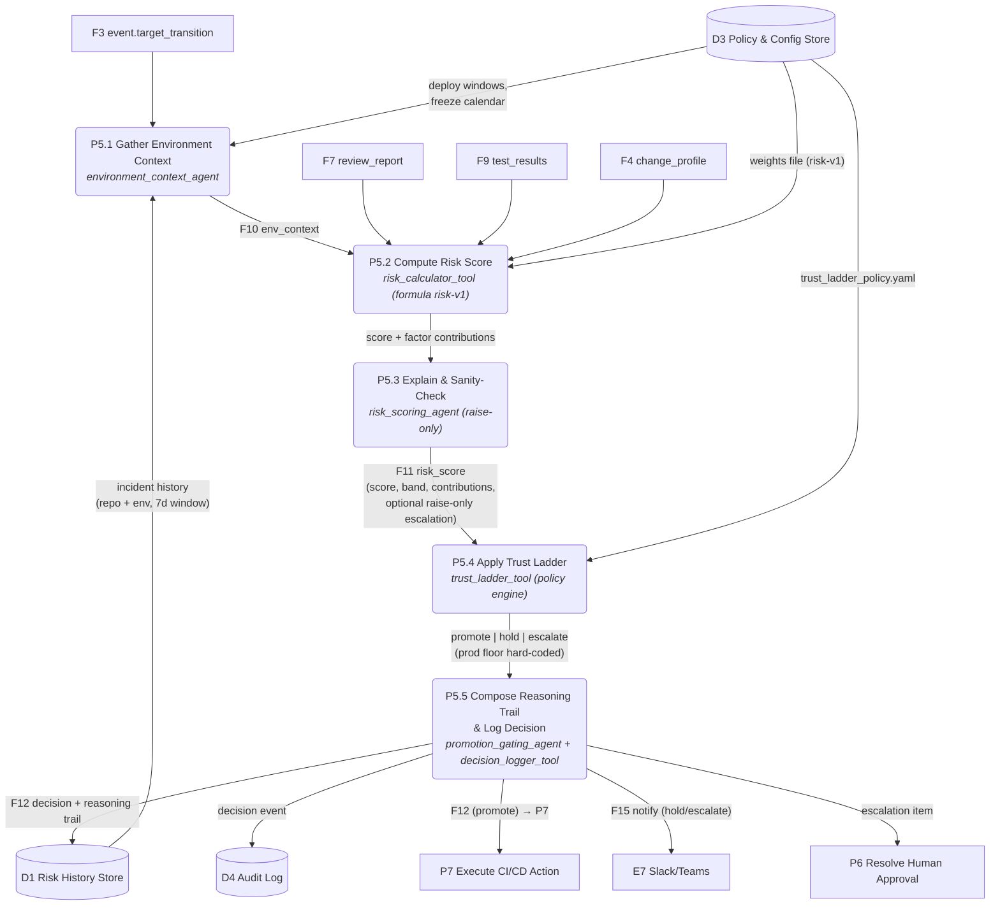
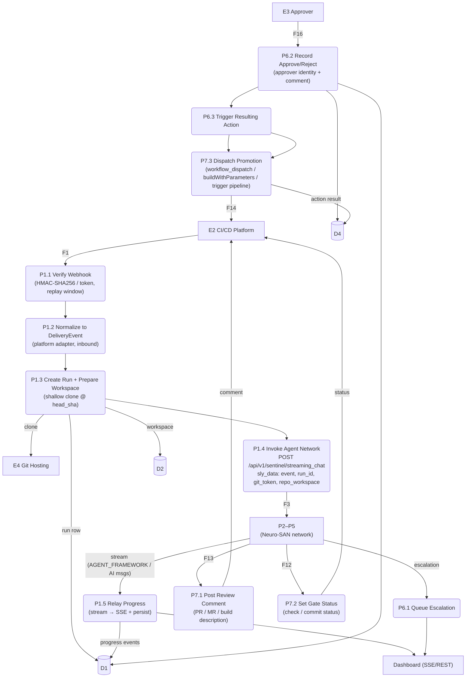

# Sentinel — Data Flow Diagrams (DFD)

**Derived from:** [01-proposed-solution.md](01-proposed-solution.md) (authoritative). Companion documents: [HLD](03-hld.md), [LLD](04-lld.md), [Architecture](05-architecture-diagram.md).
**Levels:** L0 (context) → L1 (system decomposition) → L2 (drill-down of processes 2, 3, 4 and 5).

## 0. Notation

Mermaid cannot draw strict Gane–Sarson symbols; the mapping used throughout:

| DFD element     | Rendered as   | Naming                                  |
| --------------- | ------------- | --------------------------------------- |
| External entity | Rectangle     | `E# Name`                               |
| Process         | Rounded node  | `P# Name` (L2: `P#.# Name`)             |
| Data store      | Cylinder      | `D# Name`                               |
| Data flow       | Labeled arrow | flow name from the Data Dictionary (§5) |

Every named flow and store is defined in the **Data Dictionary** (§5). Contract field detail lives in [01 §10](01-proposed-solution.md) and full JSON Schemas in [LLD §4](04-lld.md).
Coded-tool names in _italics_ are module names; HOCON tool names drop the `_tool` suffix (mapping: [LLD §3/§5](04-lld.md)).

---

## 1. Level 0 — Context Diagram

The system boundary is the **Sentinel** (Gateway + Neuro-SAN `sentinel` network + Risk History Store + Dashboard). Everything else is external.

**External entity register**

| ID  | Entity                     | Direction | Interface (detail in LLD §7)                                        |
| --- | -------------------------- | --------- | ------------------------------------------------------------------- |
| E1  | Developer                  | in/out    | Dashboard UI (HTTPS), PR comments via platform                      |
| E2  | CI/CD platform             | in/out    | Webhooks in (HMAC/token-verified); status/dispatch/trigger APIs out |
| E3  | Release manager / approver | in/out    | Dashboard approval queue; notified via E7                           |
| E4  | Git hosting                | in        | `git clone` / diff fetch with scoped read token                     |
| E5  | NVIDIA NIM                 | in/out    | OpenAI-compatible chat completions (`nvidia` provider class)        |
| E6  | OSV.dev                    | in        | REST batch query; offline snapshot fallback (demo mode)             |
| E7  | Slack/Teams                | out       | Incoming-webhook POST                                               |

---

## 2. Level 1 — System Decomposition

Processes P1–P7; stores D1–D4. P2–P5 run inside the Neuro-SAN agent network; P1, P6, P7 run in the Delivery Gateway.

**Cross-stage signal flow (the differentiator) is visible here as a pure data-flow fact:** `F7 review_report` produced by P3 is a _direct input_ to P5 — review findings mechanically raise the promotion risk score with no human relay (solves P4 of [01 §1](01-proposed-solution.md)).

---

## 3. Level 2 Drill-Downs

### 3.1 P2 — Analyze Change

| Sub-process | Deterministic core                                                       | LLM role                                                                                |
| ----------- | ------------------------------------------------------------------------ | --------------------------------------------------------------------------------------- |
| P2.1        | `git diff base..head` on D2 workspace; rename/binary detection           | none                                                                                    |
| P2.2        | tree-sitter parse per changed file; function/class span mapping to hunks | none                                                                                    |
| P2.3        | import-graph construction; reverse reachability from changed modules     | none                                                                                    |
| P2.4        | path/symbol match against sensitive-area rules                           | classify `feature/bug_fix/refactor/config/docs/mixed`; name blast radius in human terms |

### 3.2 P3 — Review Code

Dedup rule in P3.3: findings sharing `(file, overlapping line range, root cause category)` merge, keeping highest severity and both explanations (detail: LLD §3, `review_synthesis_agent` instructions).

### 3.3 P4 — Select & Execute Tests

Selection set algebra (P4.2): `selected = covering(changed_files) ∪ covering(blast_radius) ∪ smoke_set`, conservatively widened when `change_profile.sensitive_flags ≠ ∅`; the LLM may only add tests and must justify every exclusion summary line (D2 principle, [01 §5.3](01-proposed-solution.md)).

### 3.4 P5 — Score Risk & Gate Promotion

### 3.5 P1 / P6 / P7 — Gateway Processes

---

## 4. Data Stores

| ID  | Store                 | Technology                                                  | Written by         | Read by                                | Content (tables: LLD §8)                                                                                                                             |
| --- | --------------------- | ----------------------------------------------------------- | ------------------ | -------------------------------------- | ---------------------------------------------------------------------------------------------------------------------------------------------------- |
| D1  | Risk History Store    | PostgreSQL 16                                               | P1, P3, P4, P5, P6 | P5 (incidents), Dashboard, all queries | `runs`, `review_reports`, `findings`, `test_plans`, `test_results`, `env_contexts`, `risk_scores`, `decisions`, `approvals`, `incidents`, `outcomes` |
| D2  | Run Workspace         | Ephemeral filesystem volume (per-run dir, deleted post-run) | P1.3               | P2, P3, P4                             | Shallow clone at `head_sha`; test artifacts                                                                                                          |
| D3  | Policy & Config Store | Mounted config files (K8s ConfigMap / repo `config/` dir)   | Operators (GitOps) | P2.4, P4.2, P5                         | `trust_ladder_policy.yaml`, `risk_weights_v1.yaml`, `repo_config.yaml` (smoke sets, sensitive-area rules, deploy windows)                            |
| D4  | Audit Log             | PostgreSQL `audit_events` (append-only)                     | P5, P6, P7         | Dashboard audit screen                 | Actor (human/agent), action, payload ref, timestamp                                                                                                  |

## 5. Data Dictionary (Flows)

| Flow | Name              | Composition (summary — full schema LLD §4)                                                                                                                                                                | Producer → Consumer                                          |
| ---- | ----------------- | --------------------------------------------------------------------------------------------------------------------------------------------------------------------------------------------------------- | ------------------------------------------------------------ | ------- |
| F1   | Webhook event     | Platform-native PR/pipeline payload + signature header                                                                                                                                                    | E2 → P1                                                      |
| F2   | Repo content      | Shallow clone at `head_sha`; `F2a` unified diff + file list; `F2b` changed symbols; `F2c` dependents/blast radius                                                                                         | E4 → D2; internal P2                                         |
| F3   | DeliveryEvent     | `event_id, source, repo{...}, change{base_sha, head_sha, branch, pr_id?, title, description, author}, target_transition{from_env, to_env}, requested_by` + sly_data `{run_id, git_token, repo_workspace}` | P1 → P2/P5 (via streaming_chat)                              |
| F4   | change_profile    | `files[], new_functions[], classification, loc_added/removed, blast_radius{}, sensitive_flags[]`                                                                                                          | P2 → P3, P4, P5                                              |
| F5   | security_findings | `Finding[]`: `severity, category, file, line, cwe?, title, explanation, fix_suggestion, source`                                                                                                           | P3.1 → P3.3                                                  |
| F6   | quality_findings  | `Finding[]` + `quality_score`                                                                                                                                                                             | P3.2 → P3.3                                                  |
| F7   | review_report     | `executive_summary, findings[] (deduped/ranked), pr_health_score, recommendation`                                                                                                                         | P3.3 → P5, D1, P7                                            |
| F8   | test_plan         | `selected[{test_id, reason, mapping_source}], smoke_set[], excluded_summary, selection_confidence, estimated_runtime`; `F8a` raw test↔source map                                                          | P4.2 → P4.3, D1                                              |
| F9   | test_results      | `runner, command, totals{}, cases[], coverage_delta?, duration, timed_out`                                                                                                                                | P4.4 → P5, D1                                                |
| F10  | env_context       | `target_env, incidents{}, deploy_window{}, env_stability, batch_size, flags[]`                                                                                                                            | P5.1 → P5.2                                                  |
| F11  | risk_score        | `score, band, formula_version, contributions[], llm_escalation?, explanation`                                                                                                                             | P5.3 → P5.4, D1                                              |
| F12  | decision          | `decision, transition, policy_version, reasoning_trail, actions_taken[], approval_required, approval_status?`                                                                                             | P5.5 → D1, P6, P7; allow-listed to Gateway via `to_upstream` |
| F13  | review comment    | Rendered `review_report` (markdown)                                                                                                                                                                       | P7.1 → E2                                                    |
| F14  | promotion action  | Platform-specific: check status / `workflow_dispatch` / `buildWithParameters` / pipeline trigger                                                                                                          | P7.2–7.3 → E2                                                |
| F15  | notification      | Hold/escalate summary + dashboard deep-link                                                                                                                                                               | P5.5 → E7                                                    |
| F16  | approval          | `approve                                                                                                                                                                                                  | reject, comment, approver_identity`                          | E3 → P6 |

Note: flows F5, F6, F8, F10 are produced by LLM agents but land on the sly_data bulletin board via the `contract_store` coded tool ([LLD §5.17](04-lld.md)) — sly_data is writable only by coded tools ([01 §5.4](01-proposed-solution.md)).

**Invariants** (enforced by design, verifiable in audit):

1. No flow bypasses P5 to reach F14 — every platform action descends from a logged `decision` (or an approval resolving one).
2. `git_token` and `repo_workspace` appear in no flow crossing the system boundary (sly_data `to_upstream` allow-list excludes them).
3. F7 (review) is an input to F11 (risk) in every run — the cross-stage link is structural, not optional.
4. F12 with `transition = staging→production` never carries `decision = promote` without a matching F16 — the hard floor of the trust ladder.
