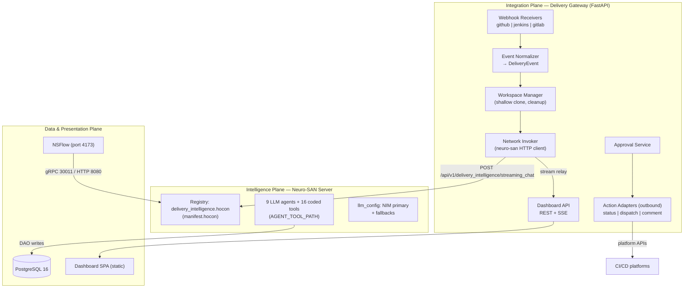
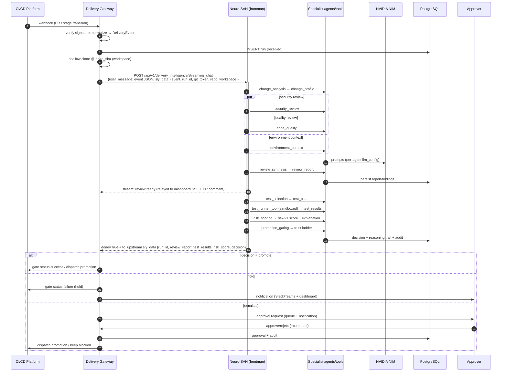
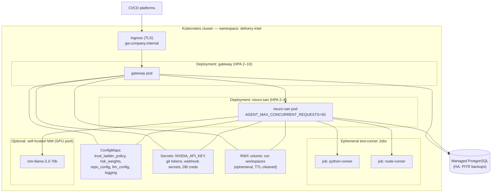

# AI Delivery Intelligence Layer — High-Level Design (HLD)

**Derived from:** [01-proposed-solution.md](01-proposed-solution.md) (authoritative solution spec). Companions: [DFD](02-dfd.md) · [LLD](04-lld.md) · [Architecture Diagram](05-architecture-diagram.md).
**Scope:** system-level structure, deployment, integration, data, security, scalability, availability, observability, and the design decisions binding the LLD.

---

## 1. Architecture Goals & Quality Attributes

| #   | Quality attribute | Target                                                                          | Achieved by                                                                      |
| --- | ----------------- | ------------------------------------------------------------------------------- | -------------------------------------------------------------------------------- |
| QA1 | Review turnaround | First-pass review report in seconds–low minutes from webhook                    | Parallel specialist agents; review published before tests run (§5.2 step 5)      |
| QA2 | CI efficiency     | Test runtime ∝ change impact, not repo size                                     | Deterministic test↔source mapping + subset execution                             |
| QA3 | Explainability    | 100% of decisions carry a queryable reasoning trail                             | Deterministic scoring/policy tools + persisted trails (D1/D4)                    |
| QA4 | Safety            | Zero unauthorized production deploys; LLM cannot lower risk                     | Hard-coded prod floor in `trust_ladder_tool`; raise-only LLM escalation          |
| QA5 | Scalability       | Horizontal scale to org-wide concurrent runs                                    | Stateless Gateway & Neuro-SAN pods; per-run isolation; HPA                       |
| QA6 | Adoptability      | Team onboarding = configuration only (webhook + repo config entry)              | Gateway adapters; no pipeline migration (D1 principle)                           |
| QA7 | Portability       | Any of GitHub Actions / Jenkins / GitLab CI; any K8s; NIM hosted or self-hosted | Adapter interface; cloud-agnostic manifests; `nvidia` provider class + fallbacks |
| QA8 | Data privacy      | Code and credentials never leave controlled boundaries                          | `sly_data` allow-lists; self-hosted NIM option; ephemeral workspaces             |

## 2. System Context

See [DFD L0](02-dfd.md#1-level-0--context-diagram). Boundary: **Delivery Gateway + Neuro-SAN server (network `delivery_intelligence`) + PostgreSQL + Dashboard/NSFlow**. Externals: CI/CD platforms, git hosting, NIM endpoint, OSV.dev, Slack/Teams, humans (developer, approver).

## 3. Logical Architecture

### 3.1 Three planes (normative decomposition)

### 3.2 Responsibility matrix

| Component         | Owns                                                                                                                                                                  | Explicitly does NOT own                                              |
| ----------------- | --------------------------------------------------------------------------------------------------------------------------------------------------------------------- | -------------------------------------------------------------------- |
| Delivery Gateway  | Platform dialects, signature verification, event normalization, workspace lifecycle, run bookkeeping, stream relay, dashboard/approval API, outbound platform actions | Any review/selection/scoring/gating logic                            |
| Neuro-SAN network | All intelligence: analysis, review, synthesis, selection, execution orchestration, context, scoring, gating decision                                                  | Platform APIs, HTTP surface for humans, persistence schema ownership |
| Coded tools       | Deterministic facts & acts (diff, AST, graph, scans, run tests, formula, policy, log, notify, act)                                                                    | Free-form judgment                                                   |
| PostgreSQL        | Durable truth: runs → decisions → approvals → audit; incident history                                                                                                 | Ephemeral run state (sly_data)                                       |
| Dashboard         | Human window: reports, trails, approvals, audit                                                                                                                       | Any decision-making                                                  |
| NSFlow            | Agent-network live visualization (demo/debug)                                                                                                                         | Production human workflows                                           |

### 3.3 Neuro-SAN capabilities used (framework grounding)

| Capability                                                                                          | Where used                                                                           | Reference                          |
| --------------------------------------------------------------------------------------------------- | ------------------------------------------------------------------------------------ | ---------------------------------- |
| HOCON agent registry + manifest (`AGENT_MANIFEST_FILE`)                                             | `registries/delivery_intelligence.hocon` in `registries/manifest.hocon`              | LLD §2                             |
| Frontman pattern (first tool, no `parameters`)                                                      | `delivery_coordinator`                                                               | LLD §3                             |
| AAOSA substitutions (`aaosa_basic.hocon`)                                                           | specialist delegation semantics                                                      | LLD §3                             |
| CodedTool (`neuro_san.interfaces.coded_tool.CodedTool`, `async_invoke(args, sly_data)`)             | all 16 tools under `coded_tools/delivery_intelligence/` (`AGENT_TOOL_PATH`)          | LLD §5                             |
| `sly_data` + `allow` blocks (`to_upstream` allow-list)                                              | secure bulletin board & result egress                                                | 01 §5.4, LLD §3 (frontman `allow`) |
| Per-agent `llm_config` + `fallbacks` + `${?MODEL_NAME}`                                             | NIM primary, right-sizing, provider agnosticism                                      | LLD §6                             |
| `structure_formats: "json"`                                                                         | frontman's final structured payload parsing                                          | LLD §3                             |
| `max_steps`, `max_execution_seconds`                                                                | long pipeline + test execution headroom (default 120 s is insufficient — overridden) | LLD §2                             |
| HTTP API `POST /api/v1/{agent}/streaming_chat`, msg types `AI(4)/AGENT_FRAMEWORK(101)`, `done` flag | Gateway invoker + progress relay                                                     | LLD §7.1                           |
| Plugins (Phoenix/Langfuse OTEL, log bridge), `AGENT_SERVICE_LOG_JSON`                               | observability                                                                        | §10                                |
| Data-driven integration test fixtures (`tests/fixtures/*.hocon`)                                    | network regression tests                                                             | LLD §11                            |

## 4. Component Architecture

### 4.1 Delivery Gateway (FastAPI, Python 3.12+)

Modules (LLD §7 specifies routes/classes):
`webhooks/` (3 receivers + verifier) · `adapters/` (inbound normalize, outbound act — one class per platform implementing `CicdAdapter`) · `workspace/` (clone/cleanup, disk quota) · `invoker/` (neuro-san HTTP streaming client, retry, timeout) · `runs/` (state machine: `received → analyzing → reviewing → testing → scoring → gated → done/failed`) · `approvals/` · `api/` (REST + SSE) · `db/` (SQLAlchemy DAO + Alembic migrations) · `static/` (dashboard SPA).

Statelessness: no in-memory run state survives a request; everything is Postgres-backed → any replica serves any request; SSE reconnects replay from persisted progress events.

### 4.2 Neuro-SAN server deployment unit

Stock neuro-san server (`python -m neuro_san.service.main_loop.server_main_loop`) in our image with: `registries/` (network + manifest), `coded_tools/delivery_intelligence/`, `config/` (llm_config, weights, policies). Key env: `AGENT_MANIFEST_FILE`, `AGENT_TOOL_PATH=coded_tools`, `AGENT_HTTP_PORT=8080` (gRPC 30011 internal), `AGENT_MAX_CONCURRENT_REQUESTS` (default 50/pod), `NVIDIA_API_KEY` (or in-cluster NIM URL), `DATABASE_URL` (coded-tool DAO), `AGENT_SERVICE_LOG_JSON=logging.hocon`.

### 4.3 Test-execution sandbox

- **Hackathon:** `test_runner_tool` runs the repo's runner as a resource-limited subprocess inside the neuro-san container (CPU/mem ulimits, wall-clock timeout, workspace-scoped cwd).
- **Production:** same tool submits an **ephemeral Kubernetes Job** (runner image per language family) with: workspace volume (read-only clone + writable scratch), no secrets beyond nothing (token never mounted — clone done by Gateway), `NetworkPolicy` egress restricted to package registries, CPU/mem/`activeDeadlineSeconds` limits; tool polls Job status and fetches the JUnit/JSON artifact. Interface identical either way (`TestResults` contract) — the sandbox strategy is a deployment detail, not a network change.

### 4.4 Dashboard

SPA (static, served by Gateway) + REST/SSE. Screens per [01 §14](01-proposed-solution.md). No business logic client-side; approval POST is the only mutating call, guarded by role `approver`.

## 5. Runtime View

### 5.1 End-to-end sequence (happy path + escalation branch)

### 5.2 Stage latency budget (order-of-magnitude, demo repos)

| Stage                          | Budget                                 | Dominant cost                  |
| ------------------------------ | -------------------------------------- | ------------------------------ |
| Webhook→invoke                 | < 5 s                                  | shallow clone                  |
| Change analysis                | 5–15 s                                 | 1–2 LLM turns + tools          |
| Parallel reviews               | 10–30 s                                | LLM reasoning over hunks       |
| Synthesis (report delivered)   | +5–15 s                                | 1 LLM turn                     |
| Test selection                 | 5–10 s                                 | mapping tool + 1 turn          |
| Test execution                 | dominated by repo's own subset runtime | native runner                  |
| Context+scoring+gating         | 10–20 s                                | 2–3 LLM turns + formula/policy |
| **Review-report-to-developer** | **≈ 30–60 s from webhook**             | QA1                            |

Network guards: `max_execution_seconds` set to 3600 (default 120 s would kill test runs), `max_steps` 40000-class headroom (LLD §2).

## 6. Deployment Architecture

### 6.1 Hackathon topology (docker-compose)

Services (one network, one volume set): `gateway` (8000; mounts workspace volume), `neuro-san` (8080 HTTP/30011 gRPC; same workspace volume; `coded_tools`+`registries` baked in), `postgres` (5432, named volume, migration job on start), `nsflow` (4173 → neuro-san). NIM = hosted endpoint (only `NVIDIA_API_KEY` leaves the machine). Compose file: LLD §10.1.

### 6.2 Production topology (Kubernetes, cloud-agnostic)

Decisions: Gateway and neuro-san scale independently (webhook bursts vs LLM-bound runs); workspaces on shared RWX volume so any neuro-san pod / Job reads any run's clone; runner Jobs get `NetworkPolicy` egress-deny + package-registry allow; self-hosted NIM optional GPU node pool — flips one env (`base_url`-style config in llm_config) with no network change; images identical to compose (QA7).

### 6.3 Sizing starting points

| Component       | Replicas   | CPU/mem                                                                 | Scale signal                                      |
| --------------- | ---------- | ----------------------------------------------------------------------- | ------------------------------------------------- |
| gateway         | 2–10 (HPA) | 0.5 vCPU / 512 Mi                                                       | RPS + SSE connections                             |
| neuro-san       | 2–8 (HPA)  | 1 vCPU / 2 Gi                                                           | in-flight runs vs `AGENT_MAX_CONCURRENT_REQUESTS` |
| test-runner Job | per run    | repo-config quota (default 2 vCPU / 4 Gi, `activeDeadlineSeconds` 1800) | n/a                                               |
| PostgreSQL      | managed HA | 2 vCPU / 8 Gi start                                                     | storage/IOPS                                      |
| NIM self-hosted | 1+         | GPU per model card                                                      | token throughput                                  |

## 7. Security Architecture

| Layer            | Control                                                                                                                                                                                                                        |
| ---------------- | ------------------------------------------------------------------------------------------------------------------------------------------------------------------------------------------------------------------------------ |
| Ingress          | TLS everywhere; webhook endpoints verify GitHub HMAC-SHA256 / GitLab secret token / Jenkins shared token; timestamp replay-window; per-platform allow-list optional                                                            |
| AuthN (humans)   | OIDC (company SSO) on dashboard/API; hackathon fallback: static bearer token                                                                                                                                                   |
| AuthZ            | Roles `viewer / approver / admin`; approver required for F16; role checks server-side in Gateway                                                                                                                               |
| Secrets          | K8s Secrets (or External Secrets → vault); git token is per-repo, read-only scope; secrets enter the network only via `sly_data`; `to_upstream` allow-list excludes them (verified invariant, DFD §5)                          |
| LLM threat model | Reviewed code = untrusted input: review agents instructed to never follow in-diff instructions; risk LLM is raise-only; gating is a deterministic policy tool; prod floor hard-coded ⇒ prompt injection cannot cause promotion |
| Test sandbox     | Ephemeral Job/container: no secrets mounted, egress-restricted, resource+time limited; results parsed, never executed                                                                                                          |
| Data at rest     | Postgres encryption-at-rest (managed); workspaces ephemeral with post-run deletion + TTL sweeper                                                                                                                               |
| Logging hygiene  | Structured JSON logs (`logging.hocon`); redaction filter for known-secret keys + secret-scanner patterns applied to own log pipeline                                                                                           |
| Audit            | Append-only `audit_events`: every decision, approval, platform action with actor identity                                                                                                                                      |
| Supply chain     | Pinned images, `pip` hashes for coded-tool deps; OSV scan of our own manifests in CI (dogfooding)                                                                                                                              |

## 8. Data Architecture

- **Postgres 16 everywhere** (compose service ↔ managed instance; identical schema via Alembic migrations owned by Gateway).
- Entity spine: `runs 1—1 review_reports 1—n findings; runs 1—1 test_plans/test_results; runs 1—1 env_contexts/risk_scores/decisions; decisions 1—n approvals; decisions 1—n outcomes; incidents(repo, env, occurred_at)` — full DDL LLD §8.
- Contracts stored as typed columns for query-critical fields + full JSONB payload (schema-versioned) for fidelity/replay.
- Retention: run artifacts default 180 d (configurable); audit_events retained per compliance policy; workspaces hours.
- `incidents` is the feedback surface: seeded manually (hackathon) / imported from incident tooling (production) and read by `incident_history_tool` — decisions consume history through this one table.

## 9. Scalability, Performance, Availability

- **Concurrency model:** one run = one streaming_chat session; neuro-san pod handles ≤ `AGENT_MAX_CONCURRENT_REQUESTS`; Gateway applies per-repo and global run-concurrency caps (backpressure: queue in `runs` table, `received` state) — burst-safe without a broker (deliberate simplicity; a queue can be added behind the invoker if ever needed).
- **Failure modes & degradation:**

| Failure                      | Behavior                                                                                                 |
| ---------------------------- | -------------------------------------------------------------------------------------------------------- |
| NIM unavailable/rate-limited | `fallbacks` chain (next provider) or run fails cleanly → `stage_failure` flag → risk +30, fail-safe hold |
| Test run timeout/crash       | `test_results.timed_out=true` → +30 risk; never silently green                                           |
| neuro-san pod dies mid-run   | Gateway invoker detects stream break → run `failed`, re-runnable idempotently (same event, new run)      |
| Postgres down                | Gateway 503s webhooks (platform retries); no decisions possible ⇒ nothing promotes (fail-closed)         |
| Gateway pod dies             | stateless; LB retries; SSE clients reconnect (replay from persisted progress)                            |
| OSV.dev unreachable          | offline snapshot fallback; finding source marked `snapshot`                                              |

- **HA:** ≥2 replicas per plane; managed Postgres HA + PITR; no single-writer bottleneck (runs are row-scoped).

## 10. Observability

| Signal           | Mechanism                                                                                                                                                          |
| ---------------- | ------------------------------------------------------------------------------------------------------------------------------------------------------------------ |
| Server logs      | Structured JSON (`AGENT_SERVICE_LOG_JSON=logging.hocon`) with `user_id`/`request_id` context filter → log stack                                                    |
| Agent traces     | Neuro-SAN plugins: **Phoenix or Langfuse** (OTEL: `OTEL_EXPORTER_OTLP_TRACES_ENDPOINT`, `LANGFUSE_*`) — per-agent spans, token usage                               |
| Agent thinking   | `THINKING_DIR` (dev/demo debugging)                                                                                                                                |
| Business metrics | Gateway Prometheus endpoint: runs by state/band/decision, stage latencies, test-minutes saved (selected vs full-suite estimate), escalation rate, approval latency |
| Progress UX      | AGENT_FRAMEWORK(101)/AI(4) stream → SSE → dashboard live timeline; NSFlow for network choreography                                                                 |
| Alerting         | Failed-run rate, webhook verification failures, fallback activation, Job quota saturation                                                                          |

## 11. Design Decisions (ADR summary)

| #   | Decision                                                            | Rationale                                                                                                         | Alternative rejected                                           |
| --- | ------------------------------------------------------------------- | ----------------------------------------------------------------------------------------------------------------- | -------------------------------------------------------------- |
| A1  | Thin Gateway outside the agent network                              | 3 webhook dialects + human API don't belong in agents; network stays portable; auth boundary                      | Webhook parsing in coded tools (couples network to platforms)  |
| A2  | Single network, frontman-orchestrated explicit pipeline             | One reasoning trail, one entry point, matches Neuro-SAN best practice (numbered pipeline + AAOSA for specialists) | Multiple chained networks (more moving parts, split trails)    |
| A3  | LLM reasons / code decides (formula, policy, runner as coded tools) | Auditability, replayability, prompt-injection firewall, deterministic demos                                       | LLM-computed scores (unauditable, gameable)                    |
| A4  | Raise-only LLM risk escalation                                      | Keeps human-favoring safety with LLM insight                                                                      | Full LLM override (unsafe) / no LLM input (loses edge cases)   |
| A5  | NIM primary + fallbacks + env-override                              | Enterprise code-privacy (self-host), hackathon-available; provider swap without HOCON edits                       | Hard-wiring one SaaS LLM                                       |
| A6  | Postgres everywhere                                                 | Zero demo/prod divergence; JSONB fits contracts; boring & operable                                                | SQLite demo→Postgres prod (divergence risk); NoSQL (no need)   |
| A7  | Ephemeral K8s Jobs for test execution (prod)                        | Untrusted code isolation, per-run limits, clean scale-out                                                         | Running tests inside agent pods (blast radius, noisy neighbor) |
| A8  | Contracts as versioned JSON Schemas in sly_data                     | Testable stages, replay, safe evolution (D7)                                                                      | Prose-passing between agents (brittle, unverifiable)           |
| A9  | Simulated-webhook demo mode via same code path                      | Demo ≠ fork; identical normalization/invocation logic                                                             | Separate demo harness (drift)                                  |

## 12. Risks & Mitigations

| Risk                                                             | Mitigation                                                                                                                                                    |
| ---------------------------------------------------------------- | ------------------------------------------------------------------------------------------------------------------------------------------------------------- |
| Open-weight model tool-calling flakiness breaks AAOSA delegation | llama-3.3-70b (strong FC) for all orchestration; explicit numbered pipeline; fallback chain; integration-test fixtures on the network (LLD §11)               |
| Test selection false negatives (skipped test would have failed)  | Always-run smoke set; conservative expansion on sensitive flags; add-only LLM; `selection_confidence=low` adds risk; full-suite override flag per repo config |
| LLM cost growth org-wide                                         | Per-agent model right-sizing; hunk-scoped prompts; run caps; token metrics per stage (§10)                                                                    |
| Webhook storms / monorepo bursts                                 | Gateway concurrency caps + `received` queue; HPA; platform retry semantics honored (202-fast)                                                                 |
| Long test suites stall sessions                                  | Sandbox `activeDeadlineSeconds` + network `max_execution_seconds=3600`; timeout ⇒ fail-safe risk contribution                                                 |
| Secrets leakage via prompts/logs                                 | sly_data-only transport; hunk-scoped prompt assembly; log redaction; secret scanner dogfooded on own logs                                                     |

## 13. Technology Stack (Pinned Intent)

| Layer          | Choice                                                                                                                                                          |
| -------------- | --------------------------------------------------------------------------------------------------------------------------------------------------------------- |
| Orchestration  | Neuro-SAN (`neuro-san==0.6.70` line), HOCON registries, AAOSA                                                                                                   |
| LLM            | NVIDIA NIM — `nvidia-llama-3.3-70b-instruct` primary (hosted `integrate.api.nvidia.com` or self-hosted NIM containers); optional env-injected fallback provider |
| Gateway/API    | Python 3.12+, FastAPI, SQLAlchemy + Alembic, httpx                                                                                                              |
| Analysis tools | GitPython/git CLI, tree-sitter (+ language packs), radon; OSV.dev API                                                                                           |
| Test execution | Native runners (pytest, jest/npm; extension table 01 §9), JUnit-XML/JSON parsing                                                                                |
| Data           | PostgreSQL 16 (JSONB contracts + typed columns)                                                                                                                 |
| UI             | Dashboard SPA (static, Gateway-served) + SSE; NSFlow `0.6.16` line                                                                                              |
| Deploy         | Docker images (python:3.13-slim base per stock Dockerfile pattern), docker-compose (demo), Kubernetes + HPA + Jobs (prod)                                       |
| Observability  | JSON logging (logging.hocon), Phoenix/Langfuse OTEL plugins, Prometheus metrics                                                                                 |
