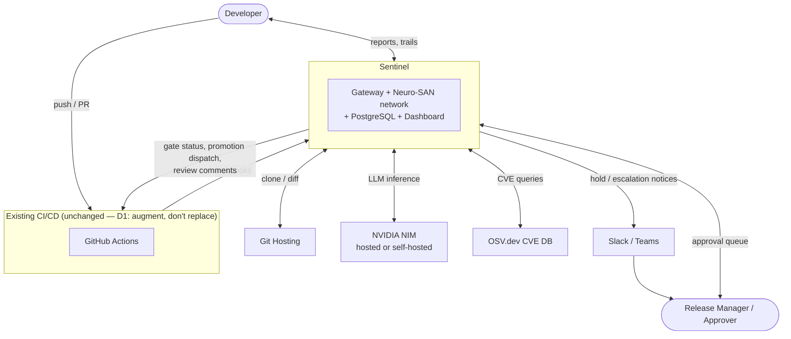
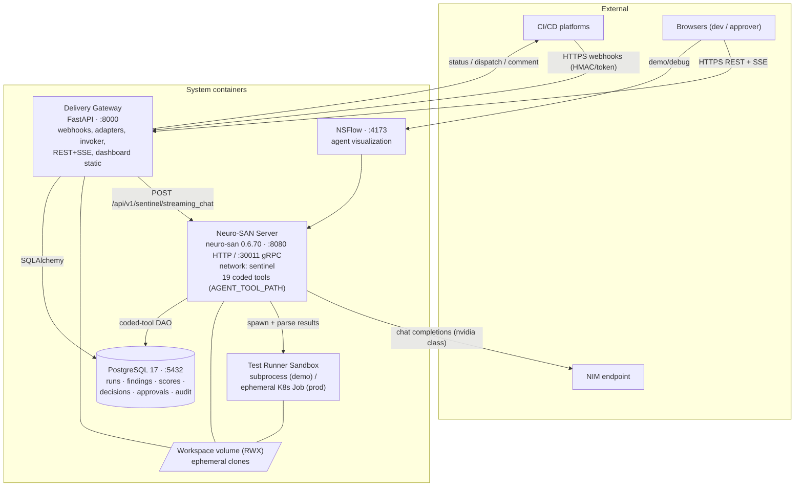
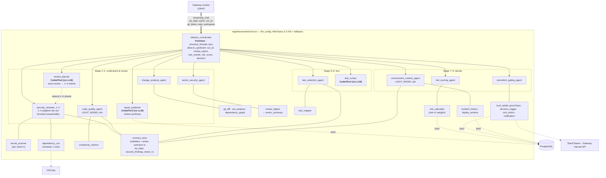
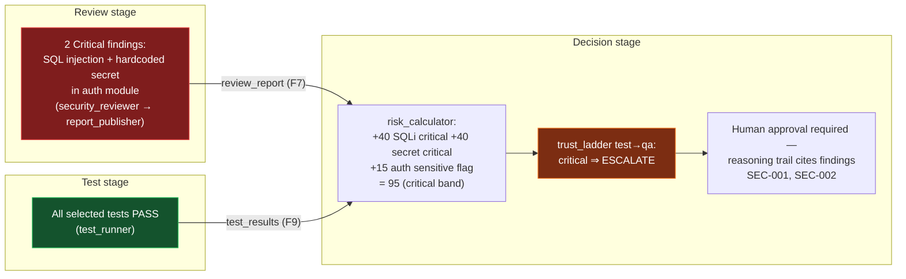
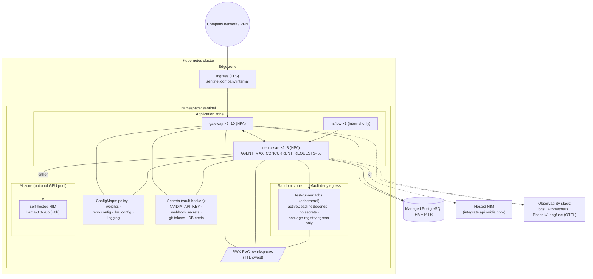
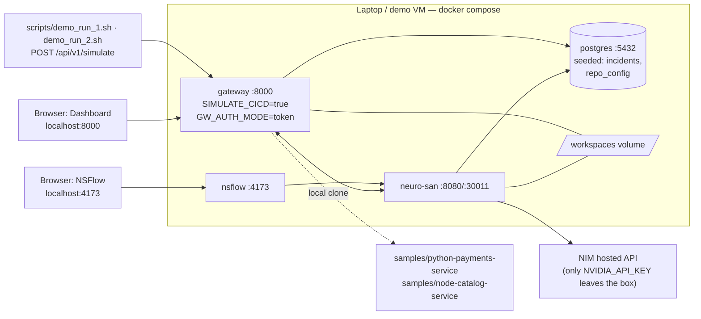

# Sentinel — Architecture Diagrams

**Author:** Harshit Anand

**Derived from:** [01-proposed-solution.md](01-proposed-solution.md) · [HLD](03-hld.md) (structure) · [LLD](04-lld.md) (element names). Six views; each states what it shows and the invariants it makes visible. Element names match the LLD exactly.

| View                              | Question it answers                                  |
| --------------------------------- | ---------------------------------------------------- |
| V1 System landscape               | What talks to the system?                            |
| V2 Container view                 | What are the deployable units, tech, ports?          |
| V3 Agent network topology         | What runs inside Neuro-SAN?                          |
| V4 Cross-stage signal flow        | Why is this different from three disconnected tools? |
| V5 Production deployment (K8s)    | How does it run company-wide?                        |
| V6 Hackathon deployment (compose) | How does the demo run?                               |

---

## V1 — System Landscape

Invariants visible: the system sits **beside** CI/CD, not inside it; all human entry points converge on one dashboard; NIM is swappable between hosted and self-hosted without changing the picture.

## V2 — Container View (deployable units)

| Container        | Image                                                                     | Scale unit            |
| ---------------- | ------------------------------------------------------------------------- | --------------------- |
| Delivery Gateway | `Dockerfile.gateway` (python 3.12 slim)                                   | HPA 2–10              |
| Neuro-SAN server | `Dockerfile.neuro-san` (python:3.13-slim base pattern, non-root uid 1001) | HPA 2–8               |
| Runner sandbox   | `Dockerfile.runner-python` / `runner-node`                                | Job per run           |
| PostgreSQL       | managed / `postgres:16`                                                   | HA pair               |
| NSFlow           | studio image                                                              | 1 (non-prod-critical) |

## V3 — Agent Network Topology (inside Neuro-SAN)

Invariants visible: exactly one frontman; specialists own only their leaf tools (no agent-to-agent shortcuts); the security review is an adaptive 1–4-shard fan-out sized by a deterministic planner, not a fixed specialist count; every deterministic element (`review_planner` sharding, `report_publisher` synthesis, `risk_calculator`, `trust_ladder`, `test_runner`) is a tool, not an LLM; sly_data egress is a five-key allow-list.

## V4 — Cross-Stage Signal Flow (the differentiator)

Binary CI gating sees only the green box and promotes. This system promotes the red box's signal across stage boundaries mechanically (`review_report` is a structural input to `risk_calculator` — DFD invariant 3). This is Demo Run 2 on one slide.

## V5 — Production Deployment (Kubernetes, cloud-agnostic)

> **Status: specified, not yet built** — post-hackathon packaging. No K8s manifests, Dockerfiles, or compose file exist today (dev is host-native, no Docker); this view is the target topology.

Security posture visible: sandbox zone isolated by NetworkPolicy; secrets never reach Jobs; self-hosted NIM keeps code in-cluster (QA8); single TLS entry point.

## V6 — Hackathon Deployment (docker-compose)

> **Status: specified, not yet built** — dev is currently host-native (local Postgres 17, `run.ps1` launcher, no Docker). This compose view is the target packaging.

Same images and code paths as V5 minus scale-out (HLD A9: the demo is a subset, not a fork). Demo choreography: Run 1 (clean change → auto-promote) and Run 2 (planted SQLi + hardcoded secret → escalate despite green tests) both visible side-by-side as dashboard reasoning trails + NSFlow agent choreography.
