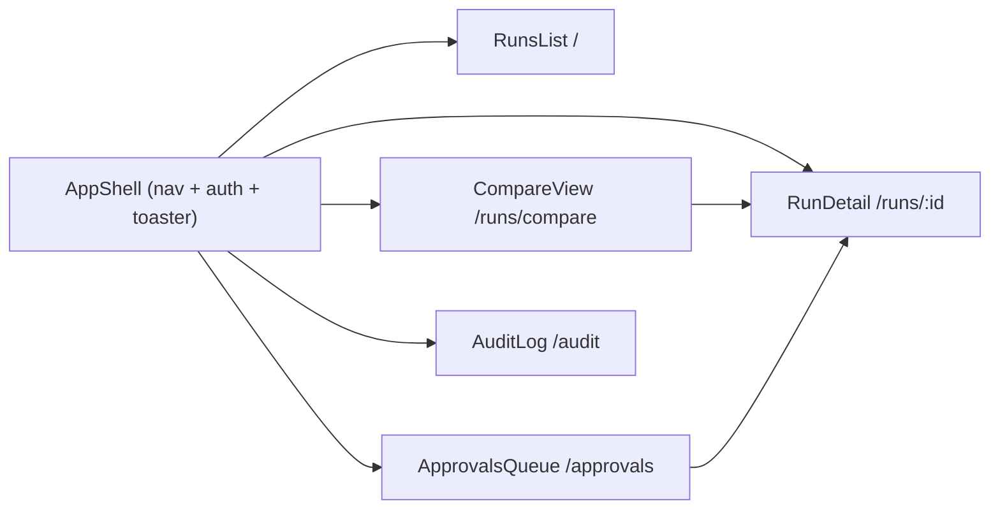
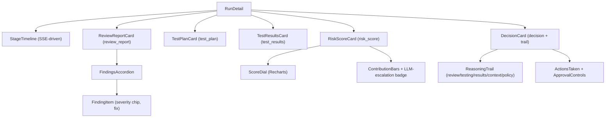
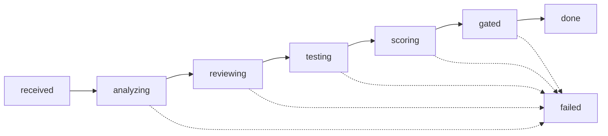

# 06 — Frontend Design (Decision Dashboard SPA)

**Derived from:** [01-proposed-solution.md](01-proposed-solution.md) §14 (dashboard scope) · [04-lld.md](04-lld.md) §7.2 (REST API), §8 (schema), §9 (screens/routes/SSE) · [03-hld.md](03-hld.md) §7 (auth roles). This document adds _no new capability_ — it is the frontend detail behind the four screens already specified in LLD §9. If anything here conflicts with 01/04, 01/04 win.

---

## 1. Scope & Non-Goals

The Decision Dashboard is a **read-mostly, explainability-first SPA** served as static files by the Gateway (`static/`, [04-lld.md](04-lld.md) §5 layout). Its job: make _why a promotion was decided_ legible, and let an approver resolve an escalation live.

**In scope** — exactly the four screens of [04-lld.md](04-lld.md) §9:

| Screen     | Route            | Primary job                                           |
| ---------- | ---------------- | ----------------------------------------------------- |
| Runs       | `/`              | find a run                                            |
| Run detail | `/runs/{id}`     | **the money screen** — the full reasoning trail, live |
| Approvals  | `/approvals`     | resolve pending escalations (Approve/Reject)          |
| Audit      | `/audit?run_id=` | append-only event log                                 |

**Write actions — only two** (everything else is read):

1. `POST /api/v1/approvals/{id}` `{action, comment}` — approver resolves an escalation.
2. `POST /api/v1/runs/{id}/rerun` — approver re-runs the same event.

**Non-goals** (deliberate — YAGNI): no run authoring/editing UI, no policy/threshold editor, no repo-config screen, no user management. The dashboard reflects backend state; it never mutates configuration. NSFlow ([04-lld.md](04-lld.md) §9, port 4173) is a **separate stock tool** used beside the dashboard in the demo — not part of this SPA.

---

## 2. Design Principles

| #   | Principle                                                          | How the UI honors it                                                                                                                                                                                                                                                                                         |
| --- | ------------------------------------------------------------------ | ------------------------------------------------------------------------------------------------------------------------------------------------------------------------------------------------------------------------------------------------------------------------------------------------------------ |
| F1  | **The reasoning trail is the hero.**                               | Run detail is a single scrollable column of decision-grade cards, not a data dump. The `decision` card (trail sections review → testing → results → context → policy) sits at the top on completed runs.                                                                                                     |
| F2  | **LLM reasons, code decides — visible in the UI** (mirrors 01 D2). | The risk card renders deterministic `contributions[]` as bars; any `llm_escalation` renders as a **separate additive badge** ("+N pts — LLM escalation") below them — never folded into the base score, never subtractive. The UI cannot show the LLM lowering risk because the data model can't express it. |
| F3  | **Staging→production is always a human gate** (01 D5).             | When `transition.to_env == "production"`, the decision card shows a permanent "Human approval required — always" lock chip regardless of band. Not derived from score client-side; reflects the hard-coded rule in `trust_ladder_tool` ([04-lld.md](04-lld.md) §5.13).                                       |
| F4  | **Live, then durable.**                                            | While a run streams (state ≠ `done`/`failed`), a stage timeline updates from SSE. On completion the same screen is a permanent, shareable, re-loadable record — no state lost on refresh.                                                                                                                    |
| F5  | **Demo-first.**                                                    | Two runs openable side-by-side (F2 happy-path vs escalation, 01 §18) is a first-class layout, not an afterthought.                                                                                                                                                                                           |
| F6  | **No secrets client-side** (01 D4).                                | The SPA only ever sees allow-listed data (`run_id, review_report, test_results, risk_score, decision` + DB reads). Tokens/workspaces/raw diffs never reach the browser — enforced server-side, assumed here.                                                                                                 |

---

## 3. Stack

| Concern      | Choice                           | Why                                                                                                                                           |
| ------------ | -------------------------------- | --------------------------------------------------------------------------------------------------------------------------------------------- |
| Framework    | **React 18 + TypeScript**        | Component model maps 1:1 to the LLD §9 card list; TS types are the wire contracts (§7).                                                       |
| Build        | **Vite**                         | `vite build` → `dist/` copied into Gateway `static/` at image build; dev server proxies API.                                                  |
| Styling      | **Tailwind CSS**                 | Utility-first; semantic color tokens (§8) encode band/severity/decision meaning.                                                              |
| Components   | **shadcn/ui** (Radix primitives) | Card, Accordion, Badge/Chip, Dialog, Table, Tabs, Toast — the exact primitives §9 needs, accessible by default. Copied in, not a runtime dep. |
| Charts       | **Recharts**                     | Risk score dial, PR-health gauge, per-factor contribution bars ([04-lld.md](04-lld.md) §9).                                                   |
| Routing      | **React Router**                 | 4 routes (§4).                                                                                                                                |
| Server state | **TanStack Query**               | REST caching, background refetch, polling fallback when SSE drops (§6).                                                                       |
| Live         | **native `EventSource`**         | SSE stream `/runs/{id}/events`; no library.                                                                                                   |

No global state store (Redux/Zustand): server state lives in TanStack Query, live state in a per-run SSE hook, UI state is local. Adding a store is deferred until a screen needs cross-route shared client state — none does today.

---

## 4. Information Architecture & Routing

```
/                     Runs list          (viewer)
/runs/:id             Run detail         (viewer)   — SSE while live
/runs/compare?a=&b=   Side-by-side       (viewer)   — demo layout, two Run-detail panes
/approvals            Approvals queue    (viewer; act = approver)
/audit?run_id=        Audit log          (viewer)
```

Routes and their API calls come straight from [04-lld.md](04-lld.md) §9 / §7.2. `/runs/compare` is the only route not in the §9 table — it is a **pure client composition of two existing `/runs/:id` views** (no new endpoint), added for F5. Everything role-gated per [03-hld.md](03-hld.md) §7 (§9 here).



---

## 5. Component Hierarchy

Run detail is assembled from **one card per contract** — each card owns exactly one backend contract, so a contract change touches one component.



**Shared components:** `BandChip`, `DecisionChip`, `SeverityChip`, `ConfidenceBadge`, `StateChip`, `HealthGauge`, `EvidenceLink`, `RelativeTime`, `RoleGate` (renders children only if the current role allows), `EmptyState`, `ErrorBoundary`.

---

## 6. Data & Live-Update Layer

### 6.1 REST (TanStack Query)

| Hook                     | Endpoint                                              | Notes                                            |
| ------------------------ | ----------------------------------------------------- | ------------------------------------------------ |
| `useRuns(filters, page)` | `GET /api/v1/runs?repo=&band=&decision=&state=&page=` | list; refetch on filter change                   |
| `useRun(id)`             | `GET /api/v1/runs/{id}`                               | full detail (all contracts + trail)              |
| `useApprovals(status)`   | `GET /api/v1/approvals?status=pending`                | queue                                            |
| `useAudit(runId)`        | `GET /api/v1/audit?run_id=`                           | log                                              |
| `useResolveApproval()`   | `POST /api/v1/approvals/{id}`                         | mutation → invalidates `useApprovals` + `useRun` |
| `useRerun()`             | `POST /api/v1/runs/{id}/rerun`                        | mutation → new run row; navigate to it           |

### 6.2 SSE (`useRunEvents(id)`)

`EventSource('/api/v1/runs/{id}/events')`. Event shape verbatim from [04-lld.md](04-lld.md) §9:

```ts
type RunEvent = {
  run_id: string;
  ts: string;
  kind: "stage_started" | "stage_done" | "agent_message" | "state_change";
  stage?: string;
  text?: string;
};
```

- `stage_started`/`stage_done` → advance `StageTimeline` (stages = state machine below).
- `state_change` → update the header `StateChip`; when it reaches `done`/`failed`, close the stream and `queryClient.invalidateQueries(['run', id])` so the durable record replaces the live one.
- `agent_message` → append to a collapsible live-log (also the SSE `aria-live` region, §10).
- **Reconnect / fallback:** on `error`, `EventSource` auto-retries; after N failures, fall back to polling `useRun(id)` every 3s until state is terminal. A dropped stream never corrupts the view — the run row is the source of truth (a truly broken run lands `failed` server-side per [04-lld.md](04-lld.md) §7.1).

### 6.3 State machine → timeline

Stages rendered in order, from `runs.state` ([04-lld.md](04-lld.md) §7.2):



Note (matches 01 §11 step 5): `reviewing` completing publishes `review_report` — the **ReviewReportCard fills in before `testing` starts**. The UI shows the review deliverable seconds in, not at the end.

---

## 7. Wire Types

TypeScript mirrors of the contracts ([01](01-proposed-solution.md) §12, [04-lld.md](04-lld.md) §4). Abbreviated; source of truth is the JSON schemas in LLD.

```ts
type Band = "low" | "medium" | "high" | "critical"; // 0–24 / 25–49 / 50–74 / 75–100 (01 §6)
type Decision = "promote" | "hold" | "escalate"; // 01 §7
type Severity = "critical" | "high" | "medium" | "low";
type Confidence = "high" | "medium" | "low"; // test selection (04 §5.9)

interface Finding {
  id: string;
  kind: "security" | "quality";
  category?: string;
  severity: Severity;
  file?: string;
  line_start?: number;
  line_end?: number;
  cwe?: string;
  title: string;
  explanation: string;
  fix_suggestion?: string;
  source: "tool" | "llm";
}
interface RiskScore {
  score: number;
  band: Band;
  formula_version: string;
  contributions: { factor: string; points: number; evidence_ref?: string }[];
  llm_escalation?: { points_added: number; justification: string }; // additive only — F2
  explanation: string;
}
interface DecisionContract {
  decision: Decision;
  transition: { from_env: string; to_env: string };
  policy_version: string;
  rule_fired: string;
  reasoning_trail: {
    review: string;
    testing: string;
    results: string;
    context: string;
    policy: string;
  };
  actions_taken: { action: string; detail: string; at: string }[];
}
```

---

## 8. Visual Design System

Semantic Tailwind tokens — color = meaning, applied identically across every chip/bar/dial so the demo audience learns the palette once.

| Semantic               | low / promote / pass | medium / hold   | high   | critical / escalate / fail |
| ---------------------- | -------------------- | --------------- | ------ | -------------------------- |
| **Band** (risk)        | emerald              | amber           | orange | red                        |
| **Decision**           | emerald (promote)    | slate (hold)    | —      | red (escalate)             |
| **Severity** (finding) | —                    | amber           | orange | red; `low` = slate         |
| **Confidence**         | emerald (high)       | amber (medium)  | —      | slate (low)                |
| **Test result**        | emerald (passed)     | slate (skipped) | —      | red (failed)               |

- Neutral surface: zinc scale; **dark mode** default (demo on projector) with a light toggle.
- Score dial color = the run's band color; the 75 threshold marked so "critical starts here" is visible.
- `source: 'llm'` findings and the LLM-escalation badge carry a subtle "AI" marker — the audience must distinguish deterministic points (bars) from LLM-added points (badge) at a glance (F2).
- Iconography via `lucide-react` (ships with shadcn/ui).

---

## 9. Auth & Role Gating

`GW_AUTH_MODE` ([04-lld.md](04-lld.md) §7.1): `token` (hackathon — static bearer in a login field, stored in memory/sessionStorage) / `oidc` (prod — company SSO redirect). Roles from [03-hld.md](03-hld.md) §7: `viewer / approver / admin`.

| Action           | Min role | UI                                                                                                                                       |
| ---------------- | -------- | ---------------------------------------------------------------------------------------------------------------------------------------- |
| view any screen  | viewer   | —                                                                                                                                        |
| Approve / Reject | approver | `RoleGate` hides controls for viewer; **reject requires a non-empty comment** ([04-lld.md](04-lld.md) §9) — submit disabled until filled |
| Rerun            | approver | button gated                                                                                                                             |
| Simulate (demo)  | admin    | hidden unless admin                                                                                                                      |

Client gating is UX only — the Gateway enforces roles per endpoint. A 401/403 surfaces as a toast + re-auth prompt.

---

## 10. Accessibility

- shadcn/ui (Radix) gives focus management, keyboard nav, and ARIA for Accordion/Dialog/Tabs/Table out of the box — do not hand-roll these.
- SSE live-log is an `aria-live="polite"` region so screen readers announce stage progress.
- Color is never the sole signal: every chip pairs color with a text label (`Critical`, `Escalate`); dials/bars carry numeric labels.
- Contrast: band/severity colors chosen for WCAG AA on the zinc surfaces in both themes.
- Full keyboard path for the approval flow (queue → open → comment → submit); reject-comment field is a required, labeled input.

---

## 11. Build & Serving

```
frontend/                       # Vite React app (new top-level dir)
  src/{components,hooks,routes,lib,types}/
  vite.config.ts                # dev proxy: /api,/webhooks,/healthz → gateway
build → dist/  ──copied──▶  gateway/static/   (04-lld.md §5 layout)
```

- **Prod/demo:** multi-stage Docker — `node` builds `dist/`, copied into the Gateway image's `static/`; Gateway serves the SPA (SPA fallback: unknown non-`/api` paths → `index.html`) alongside its REST+SSE. One origin → no CORS.
- **Dev:** `vite dev` (5173) proxies `/api`, `/webhooks`, `/healthz` to the Gateway (8000). Same relative fetch paths in both modes.
- No CDN / external asset fetch — self-contained bundle (aligns with air-gapped/code-privacy posture, 01 §15).

---

## 12. Demo Choreography (F5)

Supports 01 §18 acceptance runs:

- **Run 1 (happy path):** open `/runs/{id}` → watch timeline fill → review card early → small test subset passes → low band dial → `promote` decision card, auto-promoted, full trail.
- **Run 2 (money shot):** planted SQL-injection + hardcoded-secret change → ReviewReportCard shows **two Critical** security findings (red, `source` marked) → RiskScoreCard crosses 75 into `critical` (95 per [01 §6](01-proposed-solution.md) worked check) **even though TestResultsCard is all-green** → DecisionCard = `escalate` with the trail's `review` section citing both findings → resolve live in `/approvals`.
- **Side-by-side:** `/runs/compare?a=run1&b=run2` renders both detail panes — the two dials and two decision cards next to each other are the visual punchline. NSFlow runs beside the browser for live agent choreography.

---

## 13. Traceability

| This doc                                   | Parent                                                            |
| ------------------------------------------ | ----------------------------------------------------------------- |
| §1 screens/routes                          | [04-lld.md](04-lld.md) §9, [01](01-proposed-solution.md) §14      |
| §6 endpoints & SSE                         | [04-lld.md](04-lld.md) §7.2, §9                                   |
| §7 wire types                              | [01](01-proposed-solution.md) §12, [04-lld.md](04-lld.md) §4      |
| §8 bands/severity/decision                 | [01](01-proposed-solution.md) §6, §7                              |
| §9 auth/roles                              | [03-hld.md](03-hld.md) §7, [04-lld.md](04-lld.md) §7.1            |
| §2 F2/F3 (LLM additive, prod-always-human) | [01](01-proposed-solution.md) D2/D5, [04-lld.md](04-lld.md) §5.13 |
