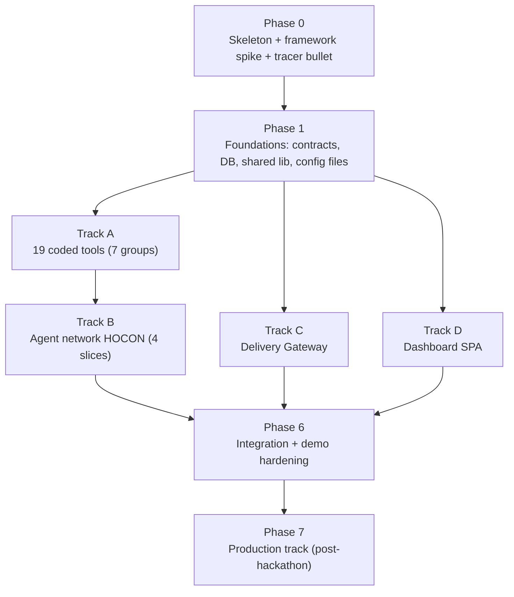

# 07 — Implementation Plan

**Author:** Harshit Anand

**Derived from:** [01-proposed-solution.md](01-proposed-solution.md) (spec) · [03-hld.md](03-hld.md) (deployment/quality attributes) · [04-lld.md](04-lld.md) (layout, HOCON, tools, API, DDL) · [06-frontend-design.md](06-frontend-design.md) (SPA).
**Strategy:** contract-first, component-based build with one early end-to-end tracer bullet, then parallel component tracks integrating at defined milestones. Phases are dependency-ordered, not calendar-bound — scale each to team size and deadline.

---

## 1. Build Philosophy

1. **Tracer bullet before fan-out.** Pure "build components → integrate at the end" discovers integration surprises last, when they are most expensive. Phase 0 therefore drives one thin slice through the entire spine (simulate → Gateway → minimal Neuro-SAN network → Postgres → JSON decision out) before any component track starts. Every risky framework assumption dies in week one or gets redesigned cheaply.
2. **Contracts are the integration interface.** D7 (versioned JSON-schema'd contracts) is what makes parallel component work safe: every track builds against `lib/contracts.py` fixtures, not against each other's code. Contracts freeze at the end of Phase 1; changing one afterwards starts in [01](01-proposed-solution.md) per repo rule.
3. **Every component is testable without its neighbors.** Coded tools are plain Python classes (`async_invoke(args, sly_data)`) — unit-testable with dict fixtures, no LLM, no server. The Gateway tests against a stubbed Neuro-SAN. The SPA tests against contract-fixture mocks. The network tests against data-driven HOCON fixtures with real tools but scripted events.
4. **Demo-critical path first.** Everything is prioritized by what Demo Runs 1 & 2 ([01 §18](01-proposed-solution.md)) need. Anything not on that path (K8s, OIDC, live webhooks) lands in later phases.

## 2. Component Map & Dependencies



After Phase 1, tracks **A/B**, **C**, and **D** are independent and can run in parallel (1 person each, or sequentially A→B→C→D solo). Track B consumes Track A groups as they finish — it does not wait for all 19 tools.

## 3. Phase 0 — Skeleton, Framework Spike, Tracer Bullet

**Goal:** the full spine works once, ugly, end to end.

| #   | Task                                                                                                                                                                                                                                                                                                                                                                                                                                                                                                                                                                                                                            |
| --- | ------------------------------------------------------------------------------------------------------------------------------------------------------------------------------------------------------------------------------------------------------------------------------------------------------------------------------------------------------------------------------------------------------------------------------------------------------------------------------------------------------------------------------------------------------------------------------------------------------------------------------- |
| 0.1 | Repo scaffold exactly per [04 §1](04-lld.md): `registries/`, `coded_tools/sentinel/`, `config/`, `gateway/`, `frontend/`, `samples/`, `deploy/`, `tests/`. Python 3.12+, `neuro-san==0.6.70` line pinned, pre-commit lint.                                                                                                                                                                                                                                                                                                                                                                                         |
| 0.2 | `deploy/docker-compose.yaml` ([04 §10.1](04-lld.md)) with `postgres` + `neuro-san` (stock server, hello-world network) + empty `gateway`. `nsflow` added when first network slice exists.                                                                                                                                                                                                                                                                                                                                                                                                                                       |
| 0.3 | Commit both sample repos: `samples/python-payments-service` (Flask + pytest, with an auth module ready for the Demo-2 SQLi plant) and `samples/node-catalog-service` (Express + Jest).                                                                                                                                                                                                                                                                                                                                                                                                                                          |
| 0.4 | **Framework spike** — verify each risky Neuro-SAN assumption with a throwaway mini-network and record findings: (a) coded tool reads/writes `sly_data`; (b) frontman `allow.to_upstream.sly_data` returns keys to an HTTP `streaming_chat` client; (c) `structure_formats: "json"` yields parsed `structure` on the final AI message; (d) `max_execution_seconds`/`max_steps`/`error_formatter` accepted at network level; (e) NIM `nvidia-llama-3.3-70b-instruct` executes a 3-step numbered pipeline with correct tool-call ordering; (f) whether it emits parallel tool calls (nice-to-have — pipeline must not require it). |
| 0.5 | **Tracer bullet:** Gateway `POST /api/v1/simulate` → hardcoded `DeliveryEvent` → `streaming_chat` to a 2-node network (frontman + `risk_calculator` stub + `trust_ladder` stub) → decision row in Postgres → `{run_id, decision}` JSON response. No review, no tests, no UI.                                                                                                                                                                                                                                                                                                                                                    |

**Exit (M0):** `docker compose up` + one curl produces a decision row and JSON response. Spike findings written into the plan/docs; any failed assumption goes back to [01](01-proposed-solution.md) as a design change **before** component fan-out.

### 3.1 Phase 0.4 Spike Findings (2026-07-08, host-native, `mistralai/mistral-small-4-119b-2603`)

Throwaway `spike.hocon` (frontman + one `SpikeProbeTool` numbered pipeline), driven over **HTTP** via `neuro_san.client.simple_one_shot.SimpleOneShot(connection_type="http")`. All six assumptions **confirmed** — none went back to [01](01-proposed-solution.md). Spike files deleted after; config fixes kept.

| # | Assumption | Result |
| - | ---------- | ------ |
| a | coded tool reads + writes `sly_data` | ✅ counter/list round-tripped across 3 calls |
| b | frontman `allow.to_upstream.sly_data` returns keys to HTTP client | ✅ only allow-listed keys reached client; a non-listed key was filtered out |
| c | `structure_formats: "json"` → parsed `structure` on final AI msg | ✅ `get_structure()` returned the parsed dict (LLM wrapped it in a ```` ```json ```` fence; parser still extracted it) |
| d | `max_execution_seconds` / `max_steps` / `error_formatter` accepted at network level | ✅ top-level keys; network loaded clean. `error_formatter` valid values `json`/`string` |
| e | model runs a numbered pipeline with correct tool-call ordering | ✅ mistral held strict `[1,2,3]` at `temperature: 0.1` (de-risks §14 worst case) |
| f | parallel tool calls | sequential observed; **not required** — pipeline never depends on it |

**Framework facts locked in (feed the real build):**
- **Client/invoker pattern (Track C):** `SimpleOneShot(agent, connection_type="http", host, port)` → `BasicMessageProcessor.get_answer()` / `.get_structure()` / `.get_sly_data()`. This is the surface [C2](#7-track-c--delivery-gateway-parallel-with-ab) builds on.
- **Coded-tool `function.parameters` types are `string|int|float|boolean|array|object`** — **not** JSON-Schema `integer`/`number` (`base_model_dictionary_converter.TYPE_LOOKUP`). Wrong type → `pydantic … UndefinedType`, network silently **skipped** at load. Applies to every real tool's param schema.
- **`use_model_name` is an alias-to-another-key, not a raw model id.** Custom entries need an alias key + a fully-specified key whose *key name* is the raw NIM id (`meta/llama-3.1-8b-instruct`, `mistralai/…-2603`) carrying `class: nvidia`. Pointing an alias straight at a raw id → `No llm entry for model_name …`. **Fixed `config/custom_llm_info.hocon`** to this pattern; both the alias path (`.env MODEL_NAME`) and inline Form B now resolve.
- **Form-B fix applied to `config/llm_config.hocon`** (raw id `meta/llama-3.3-70b-instruct`, was the unmapped `nvidia-llama-3.3-70b-instruct`).
- **Headless server run:** `python -m neuro_san.service.main_loop.server_main_loop` reads `AGENT_MANIFEST_FILE` / `AGENT_TOOL_PATH` / `AGENT_LLM_INFO_FILE` / `AGENT_HTTP_PORT` from env but **does not auto-load `.env`** — export it first. Tool class refs resolve `sentinel.<module>.<Class>` under `AGENT_TOOL_PATH=coded_tools`.

## 4. Phase 1 — Foundations (everything else builds on this)

| #   | Deliverable                                                                                                                                                                                                                                                                               | Definition of done                                                   |
| --- | ----------------------------------------------------------------------------------------------------------------------------------------------------------------------------------------------------------------------------------------------------------------------------------------- | -------------------------------------------------------------------- |
| 1.1 | `lib/contracts.py` — JSON Schemas + validators for all 11 contract schemas (16 keys) ([04 §4](04-lld.md)); fixture factory producing valid sample instances of each                                                                                                                                         | Round-trip validation tests green; fixtures importable by all tracks |
| 1.2 | `db/migrations/` — Alembic baseline with full DDL ([04 §8](04-lld.md))                                                                                                                                                                                                            | Migration applies clean on Postgres                          |
| 1.3 | `db/dao.py` — thin SQLAlchemy DAO shared by coded tools & Gateway                                                                                                                                                                                                                        | CRUD smoke tests per table                                           |
| 1.4 | `lib/workspace.py` (clone-path helpers), `lib/redact.py` (log redaction filter)                                                                                                                                                                                                           | Unit tests incl. secret-pattern redaction vectors                    |
| 1.5 | Config files: `config/risk_weights_v1.yaml` (exact table [01 §6](01-proposed-solution.md)), `config/trust_ladder_policy.yaml` ([01 §7](01-proposed-solution.md)), `config/repo_config.yaml` (both sample repos), `config/llm_config.hocon` + `custom_llm_info.hocon` ([04 §6](04-lld.md)) | Loaded & schema-checked by tests                                     |
| 1.6 | Recorded webhook payloads (GitHub PR event at minimum) as fixtures for simulate mode                                                                                                                                                                                                      | Stored under `tests/fixtures/`                                       |

**Exit (M1):** contracts frozen (v1). Tracks A/C/D may start in parallel.

## 5. Track A — Coded Tools (7 groups, each independently shippable)

Common definition of done per tool: subclasses `CodedTool`, `async_invoke` implemented, failure → `"Error: <reason>"` string (never raises), logs `run_id`, pytest unit tests with fixtures, output validates against its contract where applicable.

| Group | Tools                                                                                                | Test approach                                                                                                                                                                                                                                               | Feeds network slice |
| ----- | ---------------------------------------------------------------------------------------------------- | ----------------------------------------------------------------------------------------------------------------------------------------------------------------------------------------------------------------------------------------------------------- | ------------------- |
| A1    | `git_diff`, `ast_analyzer`, `dependency_graph`                                                       | Golden diffs on the sample repos → expected partial/final `change_profile`; rename/binary/large-file edge cases; tree-sitter python+js+ts                                                                                                                   | B1                  |
| A2    | `secret_scanner`, `dependency_cve`                                                                   | Planted-secret fixtures (AWS key, PEM, JWT, entropy); manifest-delta fixtures; OSV mocked + snapshot-fallback path                                                                                                                                          | B2                  |
| A3    | `complexity_metrics`                                                                                 | radon base-vs-head delta on fixture functions; JS heuristic counter                                                                                                                                                                                         | B2                  |
| A4    | `test_mapper`, `test_runner`                                                                         | Mapping precedence (coverage map > import graph > convention) against both sample repos; real subset execution of pytest & jest inside the runner container; timeout + env-scrub tests                                                                      | B3                  |
| A5    | `incident_history`, `deploy_window`                                                                  | Seeded `incidents` rows; frozen-clock window/freeze-date vectors                                                                                                                                                                                            | B4                  |
| A6    | `risk_calculator`, `trust_ladder`                                                                    | **Table-driven: every factor, every cap, negative `llm_escalation` clamped to 0, band edges (24/25, 49/50, 74/75); ladder matrix incl. hard prod floor and unknown-transition⇒escalate.** Highest-value tests in the project — decisions rest on these two. | B4                  |
| A7    | `report_publisher`, `decision_logger`, `cicd_action`, `notification` (+ `contract_store`, §9 item 1) | Schema-validate-then-insert tests; `SIMULATE_CICD` no-op path; notification failure is non-fatal                                                                                                                                                            | B2/B4               |
| A8    | `review_planner`, `review_digest` (+ `lib/triage.py`; extends `secret_scanner`/`report_publisher`)   | **`test_a8.py`** — exclusion globs; every `SINK_RULE` fires + a benign line doesn't; `rank()` determinism + priority; planner sizing (H=0→1 shard, just-over-budget→2, huge→cap 4); partition balance + every file assigned once; empty-tree→`mode=audit`; `agents_to_invoke` matches shard_count; digest caps at 80 + merges shard keys. All logic-only (post-M4 enhancement). | B5                  |

Recommended order: **A6 first** (pure logic, zero I/O, anchors Demo-2 math), then A1, A2/A3, A4, A5, A7, A8.

## 6. Track B — Agent Network (incremental HOCON slices)

`registries/sentinel.hocon` grows slice by slice; each slice is a runnable network verified with NSFlow interactively + a data-driven fixture test ([04 §11](04-lld.md)). Real NIM calls; sample-repo events.

| Slice | Adds                                                                                      | Verifies                                                                                                                                      | Milestone                                        |
| ----- | ----------------------------------------------------------------------------------------- | --------------------------------------------------------------------------------------------------------------------------------------------- | ------------------------------------------------ |
| B1    | frontman + `change_analysis_agent` (+A1 tools)                                            | `change_profile` lands in sly_data correct for a golden diff; sensitive-area flag fires on the auth module                                    |                                                  |
| B2    | `security_review_agent`, `code_quality_agent`, `review_synthesis_agent` (+A2/A3/A7 tools) | Planted SQLi → Critical finding; dedup + health score arithmetic; report persisted; **review slice = standalone demo of P1**                  | **M2 — review report from event, headless**      |
| B3    | `test_selection_agent`, `test_runner` (+A4)                                               | Subset ⊂ full suite, smoke set always present, LLM add-only respected, results parsed for pytest and jest                                     |                                                  |
| B4    | `environment_context_agent`, `risk_scoring_agent`, `promotion_gating_agent` (+A5/A6/A7)   | Fixture `happy_path.hocon` ⇒ `decision=promote`; `sql_injection_escalates.hocon` ⇒ `escalate` + "SQL" in trail; stage-failure path scores +30 | **M3 — full pipeline headless (both demo runs)** |
| B5    | swap `security_review_agent` → `review_planner` + `security_reviewer_1..4` + `senior_security_agent`; frontman rewrite (12-step, step-3 parallel-batch carve-out); `review_plan` persistence (+`review_planner_tool` A8) | `scripts/verify_audit.py`: default-budget audit ⇒ `shard_count=1` + coverage present; forced low budget ⇒ `shard_count≥2` + all shard contracts + no `unscanned_shards`, looped 3× (batch stability); **`verify_b4.py` still 3/3** (no regression) | post-M4 enhancement (adaptive security fan-out + audit mode) |

Frontman-instruction tuning (pipeline discipline on llama-3.3-70b) is expected to take real iteration — budget it inside B2–B4, guarded by the fixture tests as regression net. **B5 outcome (as built):** the parallel step-3 batch proved unstable on mistral over the longer 12-step chain (`report_publisher` intermittently ran before a reviewer's findings landed → an empty review, wrong `promote`). Two fixes shipped: (1) the frontman invokes reviewers **sequentially** (parallel deferred to post-hackathon — correctness unaffected, merge is deterministic); (2) **`report_publisher` recomputes the deterministic secret+sink floor itself**, guaranteeing the critical/high deterministic findings are in the report regardless of frontman ordering. With both, `verify_b4` is 3/3 and `verify_audit` (incl. a forced 3-shard run) is 3/3.

## 7. Track C — Delivery Gateway (parallel with A/B)

Built against a **stub Neuro-SAN** (canned streaming responses) until M3; the invoker is the only module that touches the real server.

| Step | Deliverable                                                                                                                                                                                     | Definition of done                                                                                               |
| ---- | ----------------------------------------------------------------------------------------------------------------------------------------------------------------------------------------------- | ---------------------------------------------------------------------------------------------------------------- |
| C1   | `app.py`, `settings.py`, DB wiring, run state machine (`received→…→done/failed`), `POST /api/v1/simulate`, workspace manager (shallow clone + cleanup)                                          | TestClient: simulate → run row transitions; idempotent duplicate `event_id`                                      |
| C2   | `invoker/neuro_san_client.py` — streaming client, AGENT_FRAMEWORK(101)/AI(4) handling, `done` + allow-listed sly_data extraction, 3700 s timeout, stream-break ⇒ `failed`                       | Works against stub; swapped to real server at integration                                                        |
| C3   | GitHub adapter (verify HMAC, normalize, gate status, PR comment, dispatch) + webhook route                                                                                                      | Signature vectors valid/invalid/replay; recorded-payload normalization                                           |
| C4   | REST + SSE: runs list/detail, `/events` SSE relay (persisted progress replay), approvals queue + resolve, rerun, audit, `/internal/publish-report`, `/internal/cicd-action`, token auth + roles | TestClient suite incl. approval flow and role gating                                                             |

## 8. Track D — Dashboard SPA (parallel after M1)

Built against MSW-style mocks generated from contract fixtures; touches the real Gateway only at integration.

| Step | Deliverable                                                                                                                                                             |
| ---- | ----------------------------------------------------------------------------------------------------------------------------------------------------------------------- |
| D1   | Vite 7 + React 19 + TS + Tailwind v4 scaffold (no shadcn), router (5 routes), auth shim (`token` mode), wire types ([06 §7](06-frontend-design.md))                                |
| D2   | Runs list + shared chips/badges (`BandChip`, `DecisionChip`, `SeverityChip`, …)                                                                                         |
| D3   | Run detail: one card per contract (ReviewReport, TestPlan, TestResults, RiskScore w/ dial + contribution bars + LLM-escalation badge, Decision w/ trail); StageTimeline |
| D4   | SSE hook (`useRunEvents`) + polling fallback; live→durable switchover                                                                                                   |
| D5   | Approvals queue (approve/reject, mandatory reject comment), Audit, `/runs/compare` side-by-side                                                                         |

**Exit (M4):** all screens render from mocks; then pointed at the real Gateway.

## 9. Pre-Integration Design Fixes (blockers found while planning) — ✅ applied to 01–06 on 2026-07-07; kept for rationale

These contradict [01](01-proposed-solution.md)/[04](04-lld.md) internals or the framework; per repo rule they must be fixed in 01 first, then propagated. Do them before B2.

1. **sly_data producer gap.** Neuro-SAN: sly_data is writable only by coded tools (`neuro-san-studio/docs/user_guide.md`, "Sly data" — bulletin-board _between coded tools_), yet [01 §5.4](01-proposed-solution.md) lists LLM agents as producers of `security_findings`, `quality_findings`, `test_plan`, `env_context`, and `test_runner` reads `test_plan` _from sly_data_. No coded tool currently writes those four keys. **Fix:** add one generic `contract_store` coded tool (args: `contract_name`, `payload`; validates against schema, writes to its sly_data key) attached to those four agents as their mandatory final step. Mirrors what `dependency_graph`/`risk_calculator` already do for their contracts.
2. **Demo Run 2 math doesn't reach its own threshold.** Planted SQLi = 1 Critical (+40) + auth flag (+15) = **55 (high)**, but [01 §18](01-proposed-solution.md) claims "risk ≥75". Also [01 §6](01-proposed-solution.md)'s worked check says test→qa escalates at 55, while the §7 ladder says test→qa/high = **hold**, not escalate. **Fix (pick one):** (a) plant a second critical (hardcoded secret) alongside the SQLi → 40+40 = 80, genuinely ≥75; or (b) run Demo 2 on the `qa→staging` transition where high (55) escalates. Option (a) recommended — showcases two agents' findings compounding. Align the §6 worked-check sentence either way.
3. **Jest selector flag version-sensitivity.** `--testPathPatterns` exists only in Jest 30+; Jest ≤29 uses `--testPathPattern`. **Fix:** `test_runner` detects installed Jest major (from `package.json`/lockfile) or simply passes patterns via `--runTestsByPath` with resolved paths. Pin Jest 30 in the sample repo.

## 10. Phase 6 — Integration & Demo Hardening

Order: **C↔B** (real invoker against real network — M3 becomes reachable through the Gateway), then **D↔C**, then demos.

| #   | Task                                                                                                                                                                          |
| --- | ----------------------------------------------------------------------------------------------------------------------------------------------------------------------------- |
| 6.1 | Swap Gateway stub for real Neuro-SAN; verify state machine transitions off real AGENT_FRAMEWORK markers; verify allow-listed sly_data arrives                                 |
| 6.2 | Point SPA at real Gateway; SSE live timeline against a real run                                                                                                               |
| 6.3 | `scripts/demo_run_1.sh` / `demo_run_2.sh` (POST simulate, assert final decision, print dashboard URL); seeded `incidents` row for the score-shift stretch                     |
| 6.4 | Full rehearsal: Run 1 auto-promote, Run 2 escalate→approve live in dashboard, `/runs/compare` side-by-side, NSFlow on second screen                                           |
| 6.5 | Hardening: log-redaction verification on real logs, k6 20-run load smoke (LLM stubbed), failure drills (kill NIM key → fallback/`stage_failure`; kill test run → timeout +30) |
| 6.6 | README: quickstart, demo script, architecture pointer to docs/solution                                                                                                        |

**Exit (M5):** both demo runs pass scripted, twice in a row, on a clean `docker compose up`.

## 11. Phase 7 — Production Track (post-hackathon, unblocks nothing above)

K8s manifest set ([04 §10.2](04-lld.md)) · `RUNNER_MODE=k8s` ephemeral Jobs + RBAC + NetworkPolicies · OIDC + roles · ExternalSecrets · Phoenix/Langfuse OTEL + Prometheus alerts · live GitHub webhook (stretch: [01 §18](01-proposed-solution.md)) · Slack/Teams live webhook.

## 12. Milestones & Demo-Critical Path

| Milestone | Proof                                                               | Depends on       |
| --------- | ------------------------------------------------------------------- | ---------------- |
| **M0**    | Tracer bullet: simulate → decision row, end to end                  | Phase 0          |
| **M1**    | Contracts frozen; DB migrates; config files load                    | Phase 1          |
| **M2**    | Review report from a real event, headless (P1 demo-able standalone) | A1–A3, A7, B1–B2 |
| **M3**    | Full pipeline headless: both demo fixtures pass                     | A4–A6, B3–B4     |
| **M4**    | Dashboard renders all screens from mocks                            | D1–D5            |
| **M5**    | Scripted Demo Runs 1 & 2 green on clean compose-up                  | Phase 6          |

Critical path: **M0 → M1 → A6/A1 → B1 → B2 → B3 → B4 → 6.1 → 6.4**. Gateway (C) and SPA (D) are off-path until 6.1/6.2 — they absorb slack. If time compresses, cut in this order: D5 compare view, 6.5 load smoke — never A6 tests, B4 fixtures, or the demo rehearsal.

## 13. 3-Day Solo Schedule (hackathon calendar mapping)

One person, 3 days. Milestones M0–M5 unchanged; everything below the cut line ships only if ahead of schedule.

| Day                                         | Target                                                                                                                                                                                                                                                                                                                                                                |
| ------------------------------------------- | --------------------------------------------------------------------------------------------------------------------------------------------------------------------------------------------------------------------------------------------------------------------------------------------------------------------------------------------------------------------- |
| **1 — Spine**                               | AM: scaffold (0.1–0.3, python sample repo first) + framework spike (0.4) + contracts/migrations/config (Phase 1, trimmed: schemas as Python dicts in `lib/contracts.py`, one Alembic revision). PM: **M0 tracer bullet**; then A6 (`risk_calculator` + `trust_ladder`, full table-driven tests) + `git_diff`. **End of day: M0 + M1 + demo arithmetic pinned.**       |
| **2 — Intelligence**                        | AM: A1 rest (`ast_analyzer`, `dependency_graph`), A2 (`secret_scanner`; `dependency_cve` snapshot-only), A3, `contract_store`, A7 (`report_publisher`, `decision_logger`, `cicd_action` simulate no-op, `notification` dashboard-row only). PM: network slices B1→B2→B3→B4; A4 pytest path first, jest second. **End of day: M3 — both demo fixtures pass headless.** |
| **3 — Surface + demo**                      | AM: Gateway real invoker (C2 against live network), simulate + runs/approvals/audit API + SSE (C1/C4, token auth only); GitHub adapter (C3) if on schedule. PM: SPA cut to runs list + run detail cards + approvals (D1–D3 + minimal D4); demo scripts + seeded incident; **two clean rehearsals = M5.** Evening buffer: compare view, NSFlow polish, README.         |
| **Cut line (pre-accepted for 3-day scope)** | k6 load smoke, OSV live API (snapshot only), Slack/Teams webhook (dashboard notification row suffices), audit screen beyond a plain table, node sample repo _if_ Day 2 slips (language-agnosticism then shown via the detection-table design, demoed on Python only).                                                         |

Solo-mode note: tracks A/B/C/D were designed for parallel people; solo they serialize on the critical path (§12) — which is exactly the Day 1→2→3 order above. The parallel-track structure still pays off post-hackathon: each track resumes independently.

## 14. Risk Register (implementation-phase)

| Risk                                                              | Mitigation                                                                                                                                                                                                                                                                             |
| ----------------------------------------------------------------- | -------------------------------------------------------------------------------------------------------------------------------------------------------------------------------------------------------------------------------------------------------------------------------------- |
| llama-3.3-70b breaks 9-step pipeline discipline (worst demo risk) | Phase 0 spike (0.4e) proves it early; explicit numbered instructions; temperature 0.1; fixture tests as regression net; `FALLBACK_MODEL_NAME` exported and rehearsed **before** demo day; sequential tool calls acceptable — parallelism (0.4f) is an optimization, never a dependency |
| sly_data mechanics differ from doc assumptions                    | §9 item 1 fix + Phase 0 spike items (a)/(b) before any agent work                                                                                                                                                                                                                      |
| Demo Run 2 lands in the wrong band                                | §9 item 2 fix; A6 table-driven tests pin the exact demo arithmetic                                                                                                                                                                                                                     |
| tree-sitter / radon friction on Windows dev machines              | All execution inside compose containers from Phase 0; host runs only editors and curl                                                                                                                                                                                                  |
| NIM hosted-endpoint rate limits or latency during rehearsal/demo  | Cache a recorded happy run (dashboard replays from DB — F4 durable view); rehearse off-peak; fallback provider key ready                                                                                                                                                               |
| Scope creep past MVP ([01 §18](01-proposed-solution.md))          | Phase 7 fence: nothing K8s/OIDC/live-webhook before M5                                                                                                                                                                                                                                 |
| B5 fan-out: long 12-step chain drops/reorders a step (`report_publisher` ran before reviewers → empty review, wrong `promote`) — **observed live, 1/3 fail** | **Shipped (both):** frontman invokes reviewers strictly sequentially (parallel deferred); AND `report_publisher` recomputes the deterministic secret+sink floor itself so critical findings are guaranteed regardless of ordering. Result: `verify_b4` 3/3, `verify_audit` 3/3. |
| B5 fan-out: model over-/under-invokes the reviewer list (runs `security_reviewer_3` on a 1-shard plan, or skips one) | Reviewer with no shard in the plan gets an empty file set from `secret_scanner` → no-op; skipped shards surface as `unscanned_shards` in coverage (never silent); `report_publisher` tolerates any subset of shard contracts |
| B5: new dangerous-sink rules trip the "happy" Demo Run 1 (expects `promote`) | Sink rules require a query keyword + variable interpolation (not any f-string); validated against the `verify_b4` happy fixture in Phase 1 before wiring into `secret_scanner` |
